# COMP90042 Natural Language Processing

## Lecture 1 Introduction

### Natural Language Processing
- **Interdisciplinary**(跨学科的) study that involves **linguitics**(语言学), **computer science** and **artificial intelligence**
- Aim: design algorithms to process and analyse human language data

### Why process text?
- **unstructured** text contains massive information
- However, first need to understand the structure

### Are Machines Intelligent yet?
- **Turing test** to assess whether a machine is intellignet
- no, the smartest conversational agent we have todat are far away from being truly intelligent

### Models and Algorithms
- state machines
	- Formal models that consist of states, transitions between states and input. E.g. finite-state-automata
- formal language theory
	- regular grammars(正则文法), context-free grammars(上下文无关语法) to explain syntax
- machine learning
	- Hidden Markov models for understanding sequences
	- Logistic regressions, SVMs for classifying text
	- Neural networks (deep learning)

### Challenges of Language
- Ambiguity
	- duck 
		- **duck** can be noun or verb
		- **her** can be a dative (与格) pronoun(代词) (i.e. indirect object to a verb) or possessive pronoun(物主代词)
		- **make** is syntactically ambiguous(句法歧义)
			- Transitive(及物动词) (takes one object: duck)
			- Ditransitive(双宾动词) (1st object: her, 2nd object: duck)
			- Can take a direct object and verb: object (her) is caused to perform the verbal action (duck)
- different languages
- contexts

## Lecture 2 Preprocessing

### Definitions
- **words**: Sequence of characters with a meaning and/or function
- **sentence**: "The student is enrolled at the University of Melbourne."
- **document**: one or more sentences
- **corpus**(语料库): a collection of documents
- **word token**: each *instance* of a word.
	- E.g. 9 word tokens in the example sentence
- **word type** *distinct* words.
	- Lexicon(词典): a group of word types
	- E.g. 8 word types in the example sentence

### Why Preprocess
- most NLP applications have documents as inputs
- **key point**: language is *compositional*. As humans, we can break these documents into individual components. To understand language, a computer should do the same.
- preprocessing is the first step

### Preprocessing Steps
- remove unwanted formatting(e.g. HTML)
- **sentence segmentation**: break documents into sentences
- **word tokenisation**: break sentences into words
- **word normalisation**: transform words into canonical forms
- **stopword removal**: delte unwanted words

### Sentence Segmentation
- naive approach: break on sentence punctuation ([.?!])
	- but periods are used for abbreviations (U.S. dollar)
- second try: yse regex to require capital ([.?!][A-Z])
	- but abbreviations often followed by names (Mr. Brown)
- better: have lexicons
	- but difficult to enumerate all names and abbreviations
	- state-of-the-art uses machine learning, not rules
- binary classifier
	- look t every "." and decides whether it is the end of a sentence
		- decision trees, logistic regression
	- features
		- words before and after "."
		- word shapes:
			- uppercase, lowercase, ALL_CAPS, number
			- Character length
		- part-of-speech(词性) tags:
			- determiners(限定词) tend to start a sentence

### Word Tokenisation
- different language have different structure and words
	- e.g. words typically seperated by a space in English. words written without spaces in Chinese
- MaxMatch algorithm
	- assumes an existing vocabulary (require lexicon)
	- greedily match the longest word in the vocabulary 
	- problems:
		- what the vocabulary is?
		- does not always work 
- subword tokenisation (byte-pair encoding)
	- colourless green ideas sleep furiously -> [colour] [less] [green] [idea] [s] [sleep] [furious] [ly]
	- one popular algorithm: byte-pair encoding(BPE)
	- core idea: iteratively merge frequent pairs of characters
	- advantage:
		- data-informed tokenisation
		- works for different languages
		- deals better with unkonw words
	- disadvantage:
		- larger vocabulary
		- creates non-sensical subwords
- byte-pair encoding
	- run thousands of merges, creating a large vocabulary
	- most *frequent words* will be represented as full words
	- *rarer words* will be broken into subwords
	- in the worst case, *unknown* words in test data will be broken into individual letter 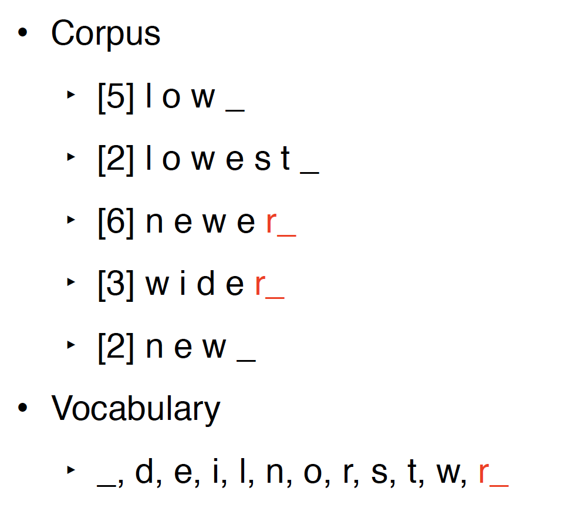

### Word Normalisation
1. lower casing (Austrilia->australia)
- removing morphology(词法) (cokking->cook)
- correct spelling (definately->definitely)
- expanding abbreviations (U.S.A->USA)
- Goal:
	- reduce vocabulary
	- maps words into the same type

- inflectional morphology(屈折词法)
	- creates grammatical variants (但不改变词性)
	- English inflects nouns, verbs, adjectives
		- dog -> dogs
		- take -> takes
		- high -> higher
	- some languages have much richer inflectional morphology
- lemmatisation
	- removes any inflection to reach the uninflected form(the lemma)
		- speaking -> speak
	- some irregularities prevent trival solution:
		- poked -> poke (not pok)
		- stopping -> stop (not stopp)
		- watches -> watch (not watch)
		- was -> be (not wa)
	- a lexicon of lemmas needed for accurate lemmatisation
- derivational morphology(派生词法)
	- creates distinct words
	- English derivational *suffixes* often change the lexical category(后缀通常改变词性)
		- personal -> personally
		- final -> finalise
		- write -> writer
	- English derivational *prefixes* often change the meaning without changing the lexical category(前缀通常不改变词性)
		- write -> rewrite
		- healthy -> unhealthy
- stemming
	- Stemming strips off all **suffixes**, leaving a stem
		- E.g. automate, automatic, automation -> automat
		- often not a actual lexical item
	- less lexical sparsity than lemmatisation
	- popular in information retrieval
	- stem not always interpretable
- the Porter Stemmer
	- most popular stemmer for English
	- applies rewrite rules in stages
		- first strip *inflectional* suffixes (-ies -> -i)
		- then *derivational* suffixes (-isation -> -ise -> -i)
		- tidying up (e.g. controll -> control)
	- c(lowercase) = consonant(辅音: e.g. 'b', 'c', 'd')
	- v(lowercase) = vowel(原音: e.g. 'a','e','i','o','u')
	- C = a sequence of consonants(e.g. 'ss', 'tr')
	- V = a sequence of vowels(e.g. 'oo','ee','io')
	- a word has one of the four forms:
		- CVCV...C
		- CVCV...V
		- VCVC...C
		- VCVC...V
	- represent as(方括号中可有可无):
		- [C]VCVC...[V]
		- [C]\(VC)m[V]
		- m = **measure** 
	- rules format: (condition)S1 -> S2
	- Always use the longest matching S1:
		- care**sses** -> caress
		- care**ss** -> caress
		- care**s** -> care
- fixing spelling errors
	- why
		- spelling errors create new, rare types
		- disrupt various kinds of linguistic analysis
		- spelling errors very common in internet corpora
		- in web search, particularly important in queries
	- how
		- string distance(Levenshtein, etc.)
		- modelling of error types(phonetic, typing etc.)
		- use an n-gram language model
- other word normalisation
	- normalising spelling variations
		- normaliza -> normalise
		- U r so coool -> you are so cool
	- expanding abbreviations
		- US, U.S. -> United States
		- imho -> in my humble opinion

### Stopward Removal
- stop words
	- definition: a list of words to be removed from the document
		- typically in bag-of-word(BOW) representations
		- Not appropriate when sequence is important
	- how to choose?
		- all *closed-class* or *function* words(e.g. the, a, of, for, he)
		- any high frequency words
		- NLTK, spaCy NLP toolkits

### Conclusion
- preprocessing unavoidable in text analysis
- can have a major effect on downstream applications
- exact steps may vary depending on corpus, task
- simple rule-based systems work well, but rarely perfect
- language dependent

## Lecture 3 N-gram Language Models
### language models
- one application in NLP is about *explaining language*
	- why some sentences are more **fluent** than others
- measure 'goodness' using **probabilities** estimated by language models
- language models can be used for **generation**
- useful for *query completion*, *optical character recognition*, *machine translation*, *summarisation*, *dialugue systems*, etc.
- pretrained language models are the backbone of modern NLP systems

### n-gram Language Models
- convert joint to conditional probabilities
	- goal is to get a probability for an arbitrary sequence of *m* words
	- apply chain rule to convert joint to condition: $P(w_1,w_2,...,w_m) = P(w_1)P(w_2|w_1)P(w_3|w_1,w_2)...P(w_m|w_1,...,w_{m-1})$
- the Markov Assumption
	- simplifying assumption: not condition on all previous words, look at a fixed size window
		- $P(w_m|w_1,...,w_{m-1}) \approx P(w_m|w_{m-n+1},...,w_{m-1})$
	- n = 1 -> unigram model(bag of word): $P(w_1,w_2,...,w_m) = \prod_{i=1}^mP(w_i)$
	- n = 2 -> bigram model: $P(w_1,w_2,...,w_m) = \prod_{i=1}^mP(w_i|w_{i-1})$
	- n = 3 -> trigram model: $P(w_1,w_2,...,w_m) = \prod_{i=1}^mP(w_i|w_{i-2}w_{i-1})$
- maximum likelihood estimation
	- estimates based on counts in our corpus
	- unigram models: $P(w_i)=\frac{C(w_i)}{M}$
	- bigram models: $P(w_i|w_{i-1})=\frac{C(w_{i-1}w_i)}{C(w_{i-1})}$
	- n-gram models: $P(w_i|w_{i-n+1}...w_{i-1})=\frac{C(w_{i-n+1}...w_i)}{C(w_{i-n+1}...w_{i-1})}$
- special tags to denote start and end of sequence:
	- \<s> = sentence start
	- \</s> = sentence end
	- don't want cross sentence combination
- trigram example: 
- problems
	- language has long distance effects - need large n
	- resulting probabilities are often very small
	- for unseen words, use special symbol to represent(e.g. \<UNK>)
	- need smoothing to solve unseen n-grams(whole term = 0)

### Smoothing
1. give unseen events some probability
2. P(everything) = 1
3. many kinds: Laplacian(add-one) smoothing, add-k smoothing, absolute discounting, kneser-ney, etc.

- **Laplacian (add-one) smoothing**
	- idea: see each n-gram once more
	- unigram models: $P_{add1}(w_i)=\frac{C(w_i)+1}{M+|V|}$
	- bigram models:  $P_{add1}(w_i|w_{i-1})=\frac{C(w_iw_{i-1})+1}{C(w_{i-1})+|V|}$
	- example: 
- **Add-k smoothing**
	- adding one is often too much
	- add a fraction k
	- AKA Lidstone smoothing: $P_{addk}(w_i|w_{i-1},w_{i-2})=\frac{C(w_{i-2},w_{i-2},w_i)+k}{C(w_{i-2}w_{i-1})+k|V|}$
	- example: 
- **absolute discounting**
	- take a **fixed** probability mass from observed n-gram counts
	- redistributes it to unseen n-grams
	- example: 
- **Katz Backoff**
	- Absolute discounting redistributes the probability mass **equally** for all unseen n-grams 
	- Katz Backoff: redistributes the mass based on a **lower order** model (e.g. unigram) 
	- issue: Katz Backoff gives higher probability to unseen n-grams with higher conuts 
- **Kneser-Ney smoothing**
	-  Redistribute probability mass based on the **versatility**(通用性) of the lower order n-gram
	-  AKA continuation probability
	-  what is versatility
		- high versatility $\rightarrow$ co-occurs with a lot of unique words, e.g. glasses: black glasses, men's glasses, etc.
		- low versatility $\rightarrow$ co-occurs with few unique words, e.g. francisco: san francisco
	- formula: 
		- Intuitively the numerator of $P_{cont}$ counts the number of unique $w_{i-1}$ that co-occurs with $w_i$
		- High continuation counts for glasses
		- Low continuation counts for Franciso
- **Interpolation**
	- A better way to combine different orders of n-gram models
	- Interpolated trigram model: $P_{IN}(w_i|w_{i-1},w_{i-2})=\lambda_3P_3(w_i|w_{i-2},w_{i-1})+\lambda_2P_2(w_i|w_{i-1})+\lambda_1P_1(w_i)$
	- $\lambda$ learned from held out data

### Conclusion
-  N-gram is a simple but effective way to capture the predictability of language
-  Can be trained in an unsupervised fashion
-  Scalable to large corpora
-  Require smoothing to be effective
-  Can be used to fix spelling errors: build a word-level LM and use left/right context words to find the most appropriate substituting word
 
## Lecture 4 Text Classification
###Classification
- Input
	- a document *d*
	- a fixed output set of classes *C* = {$c_1,c_2,...c_k$}
- Output
	- a predicted class *c*

- Text classification tasks
	- topic classification
	- sentiment analysis
	- native-language identification
	- natural language inference
	- automatic fact-checking
	- paraphrase
	
- Building a text classifier
	1.  identify a task of interest
	2. collect an appropriate corpus
	3. carry out annotation
	4. select features
	5. choose a machine learning algorithm
	6. train model and tue hyper-parameters using held-out development data
	7. repeat earlier steps as needed
	8. train final model
	9. evaluate model on held-out test data

### Algorithms for Classification
- Choosing a classification algorithm
	- bias vs. variance
		- bias: assumptions made in the model
		- variance: sensitivity to training set
	- underlying assumptions: feature independence, etc.
	- complexity
	- speed

- Naïve Bayes
	- $P(C|F) \varpropto P(F|C)P(C)$
	- assume feature independence: $p(c_n|f_1...f_m)=\prod_{i=1}^{m}p(f_i|c_n)p(c_n)$
	- pros:
		- **fast** to train and classify
		- robust, low-variance → good for **low data** situations
		- optimal classifier if independence assumption is correct
		- extremely simple to implement
	- cons:
		- Independence assumption rarely holds
		- low accuracy compared to similar methods in most situations
		- **smoothing required** for unseen class/feature combinations(probability=0)

- Logistic Regression
	- A linear model, but uses softmax “squashing” to get valid probability
	- Training maximizes probability of training data subject to regularization which encourages low(L2) or sparse(L1) weights
	- pros:
		- Unlike Naïve Bayes not confounded(打败) by diverse, correlated $\rightarrow$ better performance
	- cons:
		- slow to train
		- feature scaling needed
		- requires a lot of data to work well
		- Choosing regularisation strategy is important since **overfitting** is a big problem

- SVM
	- Finds hyperplane which separates the training data with maximum margin
	- pros:
		- Fast and accurate linear classifier
		- Can do non-linearity with kernel trick
		- Works well with huge feature sets
	- cons:
		- Multiclass classification awkward
		- feature scaling needed
		- deals poorly with class imbalance
		- interpretability
	- prior to deep learning, SVM very popular in NLP:
		- Non-linear kernel trick works well for text
		- NLP problems often involve large feature sets

- KNN
	- Classify based on majority class of k-nearest training examples in feature space
	- distance metric: euclidean distance, cosine distance, etc.
	- pros:
		- simple but effective
		- no training required
		- inherently multiclass
		- optimal classfier with infinite data
	- cons:
		- have to select *k*
		- issues with class imbalance
		- often slow(in finding neighbours)
		- features must be selected carefully

- Decision tree
	- Construct a tree where nodes correspond to tests on individual features
	- Leaves are final lcass decisions
	- based on greedy maximization of mutual information
	- pros:
		- fast to build and test
		- no need for feature scaling
		- good for small feature sets
		- handles non-linearly-sparable problems
	- cons:
		- in practice, not interpretable
		- highly redundant sub-trees
		- not compatitive for large feature sets

- Random forests
	- An **ensemble classifier**
	- Consists of decision trees trained on different subsets of the training and feature space
	- Final class decision is majority vote of sub-classifiers
	- pros:
		- Usually more accurate and more robust than decision trees
		- Great classifier for medium feature sets
		- Training easily parallelised
	- cons:
		- Interpretability
		- slow with large feature sets

- Neural networks
	- An interconnected set of nodes typically arranged in layers
	- Input layer (features), output layer (class probabilities), and one or more hidden layers
	- Each node performs a linear weighting of its inputs from previous layer, passes result through activation function to nodes in next layer
	- pros:
		- Extremely powerful, dominant method in NLP and vision
		- little feature engineering
	- cons:
		- not an off-the-shelf classifier
		- many hyper-parameters, difficult to optimize
		- slow to train
		- prone to overfitting

### Evaluation
- accuracy
- precision & recall
	- precision = $\frac{tp}{tp+fp}$
	- recall = $\frac{tp}{tp+fn}$ 
- F1 score
	- harmonic mean of precision and recall: $F1=\frac{2 \times precision \times recall}{precision+recall}$
	- defined relative to a specific positive class
	- can be used as a heneral multiclass metric:
		- Macro-average: average f1 score across classes
		- Micro-average: calculate f1 score using sum of counts(=accuracy for multiclass problems)

### Conclusion
- lots of algorithms
- *well-annotated, plentiful datasets and appropriate features* often more important than the specific algorithm used

## Lecture 5 Part of Speech Tagging
### Part of Speech
- word classes, morphological classes, syntactic categories
- Nouns, verbs, adjective, etc.
- information about a word and its neighbours
	- nouns are often preceded by determiners
	- verbs preceded by nouns
	- content as a noun pronounced as CONtent
	- content as a adjective pronounced as conTENT
- POS open classes vs. closed classes
	- how readily do POS categories take on new words
	- **open class**(quite often):
		- Nouns
			- proper (Australia) vs. common (wombat)
			- mass (rice) vs. count (bowls)
		- Verbs
			- Rich inflection (go/goes/going/gone/went)
			- Auxiliary verbs (be, have, and do in English)
			- Transitivity (wait versus hit versus give) — number of arguments
		- Adjectives
			- Gradable (happy) versus non-gradable (computational)
		- Adverbs
			- Manner (slowly)
			- Locative (here)
			- Degree (really)
			- Temporal (today)
	- **closed classes**(not very often):
		- Prepositions: *in, on, with, for, of, over,...*
		- Particles: *off*
		- Determiners
			- articles: *a, an, the*
			- demonstratives: *this, that, these, those*
			- quantifiers: *each, every, some, two,...*
		- Pronouns
			- personal: *I, she, me*
			- possessivve: *my, his, her*
			- interrogative or *Wh*: *who, what, where...*
		- Conjunctions
			- coordinating: *and, or, but*
			- subordinating: *if, althougn, that*
		- Modal verbs
			- ability: *can, could*
			- permission: *can, may*
			- possibility: *may, might, could, will*
			- necessity: *must*
		- and more: negatives, politeness markers, etc.
- ambiguity
	- word types bolong to multiple classes
	- POS depends on context 

### Tagsets
- a compact representation of POS information
	- Usually ≤ 4 capitalized characters (e.g. NN = noun)
	- Often includes inflectional distinctions
- some major English tagsets
	- Brown(87 tags)
	- Penn Treebank(45 tags)
	- CLAWS/BNC(61 tags)
	- "Universal"(12 tags)
- at least one tagset for all major languages
- major Penn Treebank tags 
	- open class
		- NN (noun singular, wombat)
			- NNS(plural, wombats)
			- NNP(proper, Australia)
			- NNPS(proper plural, Australians)
		- VB(verb infinitive(不定式，动词原形), eat)
			- VBP (1st /2nd person present, eat)
			- VBZ (3rd person singular, eats)
			- VBD (past tense, ate)
			- VBG (gerund, eating)
			- VBN (past participle, eaten)
		- JJ(adjective, nice)
			- JJR (comparative, nicer)
			- JJS (superlative, nicest)
		- RB(adverb, fast)
			- RBR (comparative, faster)
			- RBS (superlative, fatest)
	- closed class
		- PRP (pronoun personal, I)
			- PRP$ (possessive, my)
		- WP (Wh-pronoun, what)
			- WP$ (possessive, whose)
			- WDT(wh-determiner, which)
			- WRB (wh-adverb, where)
	- tagged test example: 

### Automatic Tagging
- why automatically POS tag
	- Important for morphological analysis, e.g. lemmatisation
	- For some applications, we want to focus on certain POS ‣ E.g. nouns are important for information retrieval, adjectives for sentiment analysis
	- Very useful features for certain classification tasks ‣ E.g. genre attribution (fiction vs. non-fiction)
	- POS tags can offer word sense disambiguation ‣ E.g. cross/NN vs cross/VB cross/JJ
	- Can use them to create larger structures(parsing)

#### Rule-based taggers
- Typically starts with a list of possible tags for each word 
	- From a lexical resource, or a corpus
- Often includes other lexical information, e.g. verb subcategorisation (its arguments)
- Apply rules to narrow down to a single tag 
	- E.g. If DT comes before word, then eliminate VB 
	- Relies on some unambiguous contexts
- Large systems have 1000s of constraints

#### Statistical taggers
- unigram tagger
	- Assign most common tag to each word type
	- Requires a corpus of tagged words
	- “Model” is just a look-up table
	- But actually quite good, ~90% accuracy
		- Correctly resolves about 75% of ambiguity
	- Often considered the baseline for more complex approaches
- classifier-based tagging
	- use a standard discriminative classifier(logistic regression, neural network, etc.)
	- features
		- targetword
		- lexical context around the word
		- classified tags in the sentence
	- issues: suffer from error propagation
		- wropredictions from previous steps affect the next ones
- Hidden Markov Models
	- A basic sequential (or structured) model
	- Like sequential classifiers, use both previous tag and lexical evidence
	- Unlike classifiers, considers all possibilities of previous tag
	- Unlike classifiers, treat previous tag evidence and lexical evidence as independent from each other
		- Less sparsity
		- Fast algorithms for sequential prediction, i.e. finding the best tagging of entire word sequence
- problem: unkown words
	- big problem in morphologically rich languages(e.g. Turkish)
	- Can use things we’ve seen only once (hapax legomena) to best guess for things we’ve never seen before
		- Tend to be nouns, followed by verbs
		- Unlikely to be determiners
	- Can use sub-word representations to capture morphology (look for common affixes)

### Conclusion
- POS is a fundamental intersection between linguistics and automatic text analysis
- provide usefull information for NLP applications
- methods applied are typical of language tasks in general, e.g. probabilistic, sequential machine learning

## Lecture 6 Squence Tagging: Hidden Markov Models
- sequence labelling(structured prediction)
	- decompose process into individual word level steps
	- consider the whole sequence when learning and predicting(no error propagation)

### Hidden Markov Model(HMM)
- Goal: obtain best tag sequence **t** from sentence **w**
	- $\hat{t}=argmax_tP(t|w)$
	- $\hat{t}=argmax_t\frac{P(w|t)P(t)}{P(w)}=argmax_tP(w|t)P(t)$ [Bayes]
- decompose
	- $P(w|t)=\prod_{i=1}^nP(t_i|t_{i-1})$ [prob. of a word depends only on the tag]
		- output independence: An observed event (word) depends only on the hidden state(tag)
	- $P(t)=\prod_{i=1}^nP(t_i|t_{i-1})$ [prob. of a tag depends only on the previous tag]
		- Markov assumption: the current state(tag) depends only on previous state
- training
	- parameters(individual probabilities)
		- $P(w_i|t_i)$ = **emission** (O) probabilities
		- $P(t_i|t_{i-1})$ = **transition** (A) probabilities
	- training use Maximum Likelihood Estimation(MLE) $\rightarrow$ done by counting word frequencies
	- $P(like|VB)=\frac{count(VB,like)}{count(VB)}$
	- $P(NN|DT)=\frac{count(DT,NN)}{count(DT)}$
	- using \<s> to represent the start of a sentence
	- for unseen (word,tag) or (tag,previous_tag) $\rightarrow$ smoothing
	- **transition matrix** 
	- **emission (observation) matrix** 
- prediction(decoding)
	- $\hat{t}=argmax_t\frac{P(w|t)P(t)}{P(w)}=argmax_tP(w|t)P(t)=argmax\prod_{i=1}^nP(w_i|t_i)P(t_i|t_{i-1})$
	- simple idea: a greedy fashion from left to right (wrong!) $\rightarrow$ a local classifier: error propagation
	- correct way: consider all possible tag combinations, evaluate them, take the max $\rightarrow$ complexity:$T^N$

### The Viterbi Algorithm
- dynamic programming
- keep track of **scores for each tag** for previous words and check with different tags of the current word
- example:    
- Complexity: O(T2N), where T is the size of the tagset and N is the length of the sequence.
	- T * N matrix, each cell performs T operations
- why it works?
	- **independence assumptions** decomposes the problem
- use **log** probabilities to prevent underflow and convert multiplications to sums
- Vectorisation (use matrix-vector operations)

### HMMs In Practice
- example above based on **bigrams** (first order HMM)
- state-of-the-art use trigrams (second order HMM)
	- $P(t)=\prod_{i=1}^nP(t_i|t_{i-1},t_{i-2}) \rightarrow$ now complexity: $O(T^3N)$
- need to deal with sparsity: some tag trigram sequences might not be present in training data
	- Interpolation: $P(t_i|t_{i-1},t_{i-2})=\lambda_3P(t_i|t_{i-1},t_{i-2})+\lambda_2P(t_i|t_{i-1})+\lambda_1P(t_i)$
	- $\lambda_1+\lambda_2+\lambda_3=1$
- highly effective for POS tagging
	- trigram HMM gets 96.5% accuracy
	- related models are state of the art
		- MEMMs 97%
		- CRFs 97.6%
		- Deep CRF 97.9%

### Generative vs. Discriminative Taggers
- HMM is **generative**
	- $\hat{T}=argmax_TP(T|W)=argmax_TP(W|T)P(T)=argmax_T\prod_{i=1}^NP(w_i|t_i)P(t_i|t_{i-1})$
	- trained HMM can generate data(sentences)
	- allows for unsupervised HMMs: learn model without any tagged data!
- **discriminative** models
	- model $P(T|W)$ directly
		- $\hat{T}=argmax_TP(T|W)=argmax_T\prod_{i=1}^NP(t_i|w_i,t_{i-1})$ 
	- supports richer feature set
	- generally better accuracy when trained over large supervised datasets
	- E.g., Maximum Entropy Markov Model (MEMM), Conditional random field (CRF)
	- most deep learning models of sequences are discriminative

### Conclusion
- HMMS are a simple but effective way to perform sequence labelling
- competitive and fase. Natural baseline for other sequence labelling models
- Main drawback: not very flexible in terms of feature representation, compared to MEMMs and CRFs

## Lecture 7 Deep Learning for NLP: Feedforward Networks
### Feedforward Neural Networks Basics
- feedforward NN
	- multilayer perceptrons
	- Each arrow carries a weight, reflecting its importance
	- certain layers have non-linear activation functions 
- neuron
	- each neuron is a function
	- given input x, computes real-value (scalar) h: $h=tanh(\sum_jw_jx_j+b)$
	- scales input (with weights, w) and adds offset (bias, b)
	- applies non-linear function, such as logistic sigmoid, hyperbolic sigmoid (tanh), or rectified linear unit $\rightarrow$ to achieve non-linear decision boundary
	- *w* and *b* are parameters of the model
- Matrix Vector Notation
	- $\overrightarrow{h_i}=tanh(W\overrightarrow{x}+\overrightarrow{b})$
	- Where *W* is a matrix comprising the weight vectors, and $\overrightarrow{b}$ is a vector of all bias terms
	- non-linear function applied element-wise
- output layer
	- binary classification $\rightarrow$ sigmoid activation function
	- multi-class classification $\rightarrow$ softmax function
- regularisation
	- many parameters, overfits easily
	- low bias, high variance
	- regularisation is very important in NNs
	- L1-norm: sum of absolute values of all parameters
	- L2-norm: sum of squares
	- dropout: randomly zero-out some neurons of a layer
- dropout
	- dropout rate: percentage of neuron to randomly zero-out
	- mostly used in hidden layers
	- why work?
		- It prevents the model from being over-reliant on certain neurons
		- It penalises large parameter weights
		- It introduces noise into the network

### Applications in NLP
- topic classification
	- given a document, classify it into a predifined set of topics
	- input: bag-of-words
	- possible improvements:
		- add bag of bigrams as input
		- Preprocess text to lemmatise words and remove stopwords
		- Instead of raw counts, we can weight words using TF-IDF or indicators
- NNs as lanuage model
	- word embeddings
		- Maps discrete word symbols to continuous vectors in a relatively low dimensional space
		- allow the model to capture similarity between words
	- concatenate input words embeddings as input to NNs
	- NNs output give probability distribution over all words in the vocabulary
	- architecture: 
	- advantages
		-  count-based n-gram models
			- cheap to train (just collect counts)
			- problems with sparsity and scaling to larger contexts
			- don’t adequately capture properties of words (grammatical and semantic similarity), e.g., film vs movie
		- FFNN n-gram models
			- automatically capture word properties, leading to more robust estimates
	- limitations
		- slow to train
		- capture only limited context
		- unable to handle unseen words(no embeddings!)

### Convolutional Networks
- commonly used in CV
- identify indicative local predictors
- combine them to produce a fixed-size representation
- in NLP:
	- use sliding widow over a sequence
	- W = convolution filter
	- max-pool to produce a fixed-size representation 

### Conclusion
- pros:
	- excellent performance 
	- less hand-enginerring of features
	- flexible - customised architecture for different tasks
- cons
	- much slower than classical ML models, needs GPU
	- lost of parameters due to vocabulary size
	- data hungry, not good on tiny data sets
		- pre-training on big corpora helps

## Lecture 8 Deep Learning for NLP: Recurrent Networks
Problem in n-gram language models: limited context(only a few words)
### Recurrent Neural Networks(RNN)
- Allow representation of arbitrarily sized inputs
- Core Idea: processes the input sequence one at a time, by applying a recurrence formula
- Uses a **state** vector to represent contexts that have been previously processed

- RNN unrolled  same parameters $W_s, W_x, b, W_y$ are used across all time steps
- training
	- An unrolled RNN is just a very deep neural network
	- But parameters are shared across all time steps
	- To train RNN, we just need to create the unrolled computation graph given an input sequence
	- And use backpropagation algorithm to compute gradients as usual $\rightarrow$ backpropagation through time

- RNN as language model 
- potential problems with the generation approach
	- Mismatch between training and decoding: model only trained with fluent sentences
	- error propagation: unable to recover from errors in intermediate steps $\rightarrow$ each output character is conditioned on the previous true character. However during testing, the model needs to rely on its own previous predictions
	- tends to generate 'bland' or 'generic' language: large amount of generic words in training data

### LSTM
RNN seems to have the capability to model infinite context. In practice it can't capture long-range dependencies due to **vanishing gradients**: Gradients in later steps diminish quickly during backpropagation, earlier inputs do not get much update. 

- LSTM is introduced to solve vanishing gradients, only with a few more parameters and produce pretty good word embeddings
- Core idea: have “memory cells” that preserve gradients across time
- Access to the memory cells is controlled by “gates”
- For each input, a gate decides:
	- how much the new input should be written to the memory cell
	- and how much content of the current memory cell should be forgotten
- gating vector
	- A gate ***g*** is a vector
		- each element has values between 0 to 1
	- **g** is multiplied component-wise with vector **v**, to determine how much information to keep for **v**
	- Use sigmoid function to produce **g**: values between 0 to 1 
- forget gate 
	- controls how much information to forget in the memory cell $C_{t-1}$
- input gate 
	- controls how much new information to put into memory cell
- update memory cell 
	- use the forget gate and input gate to update memory cell
- output gate 
	- controls how much to distill(提取，蒸馏) the content of the memory cell to create the next state $h_t$
- summary 

- disadvantage
	- still unable to caputer very long range dependencies
	- much slower than simple RNNs due to a lot more computation steps

### Applications
- Shakespeare generator
- Wikipedia generator
- code generator
- text classification: particularly suited for tasks where order of words matter
- sequence labelling
- varaints
	- Peephole connections: allow gates to look at cell state: $f_t=\sigma(W_f[\color{red}{C_{t-1}},h_{t-1},x_t]+b_f)$
	- Gated Recurrent Unit(GRU): simplified vatiant with only 2 gates and no memory cell(less computation but similar performance) 
- multi-layer LSTM 
- bidirectional LSTM 

### Conclusion
- pros
	- Has the ability to capture long range contexts
	- Just like feedforward networks: flexible
- cons
	- slower than FFNN due to sequential processing
	- In practice doesn’t capture long range dependency very well
	- In practice also doesn’t stack well (multi-layer LSTM)
	- less popular due to more advanced architectures: Transformer

## Lecture 9 Lexical Semantics
### Sentiment Analysis
- bag of words, KNN classifier
- training data:
	- 'this is a good movie' $\rightarrow \uparrow$
	- 'this is a great movie' $\rightarrow \uparrow$
	- 'this is a terrible film' $\rightarrow \downarrow$
- testing: 'this is a wonderful film' $\rightarrow \downarrow$
- problems
	- the model does not know 'movie' and 'film' are synonyms.
	- 'film' only appears in negative examples, learnt as negative word
	- 'wonderful' is not in the vocabulary
- comparing words directly does not work, how to compare **word meanings** instead?
- solution: add this information explicitly though a **lexical database**

### Lexical Database
- lexical semantics
	- How the meanings of words connect to one another.
	- Manually constructed resources: lexical database
- what is meaning
	- dictionary definition
		- but necessarily circular
		- only useful if meaning is alread understood 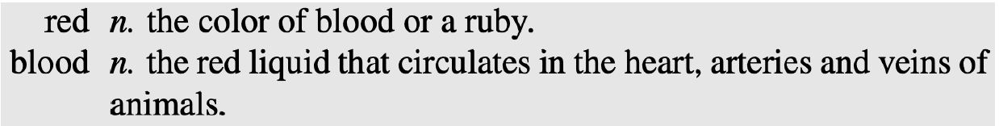
	- relationships with other words
- definitions
	- word sense: one aspect of the meaning of a word, if a word has multiple senses, it is **polysemous**(多义的) 
	- meaning through dictionary
		- gloss: textual definition of a sense, given by dictionary
	- meaning through relations 
		- Synonymy: near identical meaning
			- vomit vs. throw up
			- big vs. large
		- Antonymy: opposite meaning
			- long vs. short
			- big vs. little
		- Hypernymy: is-a relation
			- cat is an animal
			- mango is a fruit
		- Meronymy: part-whole relation
			- leg is part of a chair
			- wheel is part of a car
- WordNet
	- A database of lexical relations
	- English WordNet includes ~120,000 nouns, ~12,000 verbs, ~21,000 adjectives, ~4,000 adverbs
	- On average: noun has 1.23 senses; verbs 2.16
	- WordNets available in most major languages (www.globalwordnet.org, https://babelnet.org/)
	- English version freely available (accessible via NLTK)
	- synsets (words group by senses)
		- Nodes of WordNet are not words or lemmas, but **senses**
		- They are represented by sets of synonyms, or **synsets**
		- Bass synsets:
			- {bass1, deep6}
			- {bass6, bass voice1, basso2}
		- Another synset:
			- {chump1, fool2, gull1, mark9, patsy1, fall guy1, sucker1, soft touch1, mug2}
			- Gloss: a person who is gullible and easy to take advantage of
	- hypernymy chain example 

### Word Similarity
can use lexical database to estimate word similarity

- paths
	- based on path length
	- pathlen($c_1,c_2$) = 1 + edge length in the shortest path between sense $c_1, c_2$ (a node in the Wordnet graph is a synset(sense), not a word)
	- similarity between two synsets: $simpath(c_1,c_2)=\frac{1}{pathlen(c_1,c_2)}$
	- similarity between two words: $wordsim(w_1,w_2)=max_{c_1\in{senses(w_1)},c_2\in{senses{w_2}}}simpath(c_1,c_2)$ 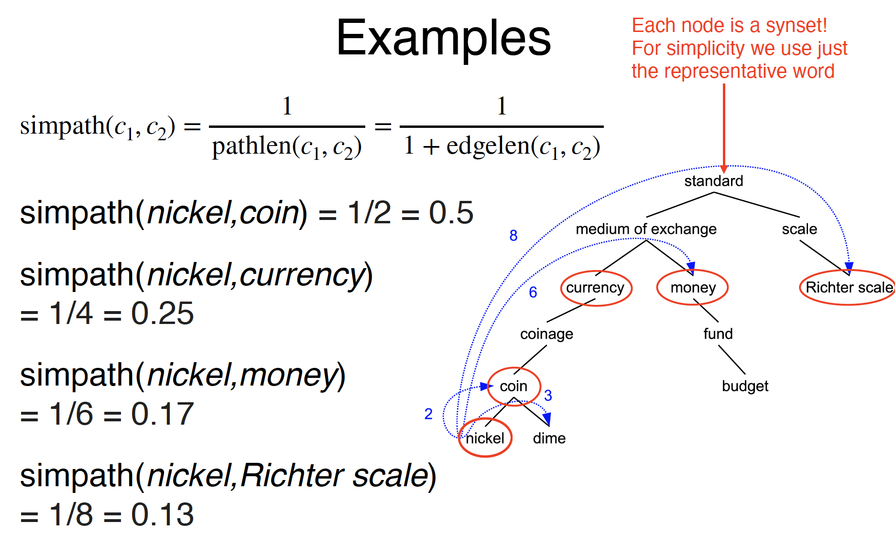
	- problem
		- edges vary widely in actual semantic distance: much bigger jumps near top of hierarchy
	- solution: include depth information
- simwup
	- Use path to find lowest common subsumer (LCS)
	- Compare using depths
	- $simwup(c_1,c_2)=\frac{2\times depth(LCS(c_1,c_2))}{depth(c_1)+depth(c_2)}$ (high simwup when parent is deep, senses are shallow) 
	- still poor semantic distance metric
	- Nodes high in the hierarchy is very abstract or general (need to penalise similarity)
- concept probability of a node
	- Intuition:
		- general node → high concept probability (e.g. object)
		- narrow node → low concept probability (e.g. vocalist)
	- Find all the children $\in$ node, and sum up their unigram probabilities: $P(c)=\frac{\sum_{s\in child(c)}count(s)}{N}$
	- child(c): synsets that are children of c
	- child(*geological-formation*) = {*hill, ridge, grotto, coast, natural elevation, cave, shore*}
	- child(*natural elevation*) = {*hill, ridge*} 
	- abstract nodes higher in the hierarchy has a higher P(c) 
	- similarity with information content
		- $IC=-logP(c)$ (general concept = small values, narrow concept = large values)
		-  $simlin(c_1,c_2)=\frac{2\times{IC(LCS(c_1,c_2))}}{IC(c_1)+IC(c_2)}$ (high simlin when: concept of parent is narrow, concept of senses are general)
		-  example 

### Word Sense Disambiguation
- Task: selects the correct sense for words in a sentence
- Baseline: Assume the most popular sense
- Good WSD potentially useful for many tasks
	- Knowing which sense of *mouse* is used in a sentence is important!
	- Less popular nowadays; because sense information is implicitly captured by contextual representations
- supervised WSD
	- Apply standard machine classifiers
	- Feature vectors typically words and syntax around target
		- But context is ambiguous too!
		- How big should context window be? (in practice small)
	- Requires sense-tagged corpora
		- E.g. SENSEVAL, SEMCOR (available in NLTK)
		- Very time consuming to create!
- unsupervised: Lesk
	- Lesk: Choose sense whose WordNet gloss overlaps most with the context
	- The bank can guarantee deposits will eventually cover future tuition costs because it invests in adjustable-rate mortgage securities. 

### Conclusion
- Creation of lexical database involves expert curation (linguists)
- Modern methods attempt to derive semantic information directly from corpora, without human intervention

## Lecture 10 Distributional Semantics
### Lexical Databases Problems
- Manually constructed
	- Expensive
	-  Human annotation can be biased and noisy
-  Language is dynamic
	-  New words: slang, terminology, etc.
	-  New senses
-  The Internet provides us with massive amounts of text. Can we use that to obtain word meanings?

### Distributional Hypothesis
- learn word meanings by its neighbouring context
- Document co-occurrence indicative of topic (document as context)
	- E.g. voting and politics
	- if we observe documents, we can find that these two words often co-occur in a document.
	- differnet words' co-occurrence document reflect relations between words and topics
- Local context reflects its meaning (word window as context)
	- E.g. eat a pizza vs. eat a burger
	- *pizza* and *burger* have the same context *eat*
	- two words both a meaning that relates to *eat*

### Guessing Meaning from Context
- learn unknown word from its usage
	- *tezgüino*

- look at words that share similar contexts 

### Word Vectors
- in the above table, each row can be thought of a word vector (if a word appears in a sentence)
- It describes the distributional properties of a word
	- i.e. encodes information about its context words
- Capture all sorts of semantic relationships (synonymy, analogy, etc)

### Word Embeddings
other ways to produce word vectors: count-based and neural methods.

#### Count-based Methods
- **document as contex**t: the Vector Sapce Model (VSM)
	- Core idea: represent word meaning as a vector
	- Consider documents as context
	- One matrix, two viewpoints (row: document vector, column: word vector)
		- Documents represented by their words
		- Words represented by their documents 
	- manipulating the values
		- Weighting the values (not only raw count)
		- Creating low-dimensional dense vectors
			- for 1 million documents, the dimension of word vector is 1 million. word vectors are sparse since a lot of 0s.
	- Tf-idf (Term Frequency(词频)-Inverse Document Frequency(逆向文件频率))
		- Standard weighting scheme for information retrieval
		- Discounts common words (contain less useful information)
		- $idf_w=log\frac{|D|}{df_w}$ ($|D|$: total #docs, $df_w$: #docs that has w)  
	- dimensionality reduction
		- Term-document matrices are very sparse (a lot of 0s)
		- Dimensionality reduction: create shorter, denser vectors
		- More practical (less features)
		- Remove noise (less overfitting)
		- Singular Value Decomposition (SVD)
			- $A=U\sum{V^T}$ 
		- truncating - Latent Semantic Analysis (LSA)
			- Truncating $U$, $\sum$, and $V$ to *k* dimensions produces best possible *k* rank approximation of original matrix
			- $U_k$ is a new low dimensional representation of words
			- Typical values for *k* are 100-5000 
- **word as context**
	- how often words appear with other words
		- In some predefined context (e.g. a window of N words)
	- The obvious problem with raw frequency:
		- dominated by common words ('the')
		- can’t use tf-idf since no documents involved, instead use PMI 
	- Pointwise Mutual Information (PMI)
		- For two events x and y, PMI computes the discrepancy(差异) between:
			- Their joint distribution = $P(x,y)$
			- Their individual distributions (assuming independence) = $P(x)P(y)$
			- $PMI(x,y)=log_2\frac{P(x,y)}{P(x)P(y)}$
			- example: 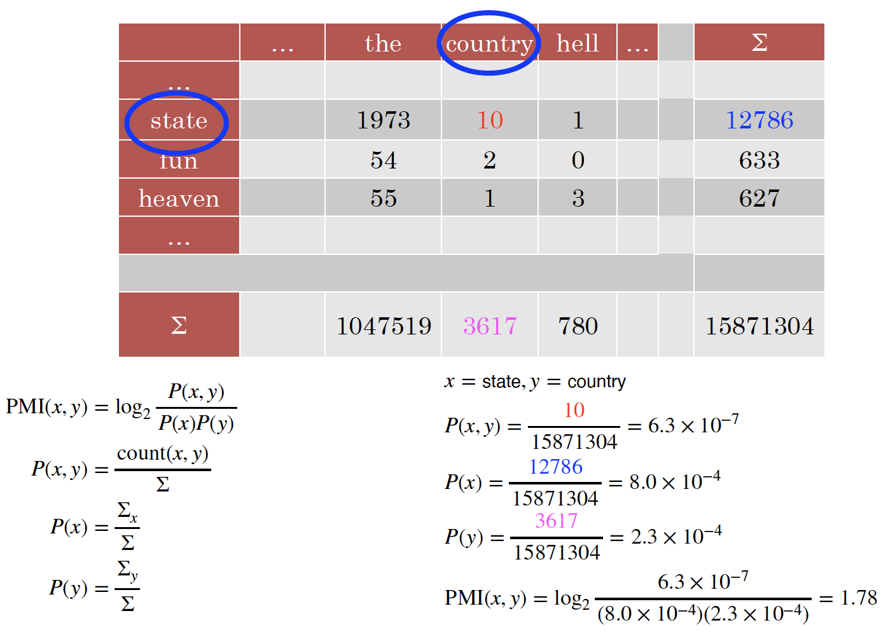
		- PMI matrix
			- PMI does a better job of capturing semantics
				- E.g. heaven and hell
			- very biased towards rare word pairs ($P(x)P(y)$ very small)
			- doesn’t handle unseen pairs well ($log_20=-\infty$)
		- PMI tricks
			- Zero all negative values (Positive PMI)
				- Avoid –inf and unreliable negative values
			- Counter bias towards rare events
				- normalised PMI: $\frac{PMI(x,y)}{-logP(x,y)}$
		- can still apply SVD
			- Regardless of whether we use document or word as context, SVD can be applied to create dense vectors 
- word vs. document as context
	- 如果我们采用 TF-IDF，我们捕获到的语义学信息会更加宽泛，通常和某种主题关联；如果我们采用 PMI/PPMI，我们捕获到的词向量更多是关于局部单词上下文的语义学信息。

#### Neural Methods
In lecture 7 and 8, neural networks are designed for other tasks (classification, language modelling), word embeddings are just a **by-product**.
Desiderata(理想模型): unsupervised(no labelling cost) and efficient(can be used in various downstream tasks)

- Word2Vec
	- Core idea
		- *You shall know a word by the company it keeps*
		- Predict a word using context words
	- Framed as learning a classifier
		- **Skip-gram**: predict surrounding words of target word 
		- **CBOW**: predict target word using surrounding words
		
		Two methods are inverse to each other
	- use surrounding words with L position, L=2 above
	- skip-gram model
		- predicts each neighbouring word given target word
		- total probability: $\prod_{l\in{-L,...,-1,1,...,L}}P(w_{t+l}|w_t)$
		- using a logistic regression model: $P(life|rests)=\frac{exp(W_{rests}\cdot{C_{life}})}{\sum_{u\in{V}}exp(W_{rests}\cdot{C_u})}$ ($W_{rests}$: word embedding of rests,$C_{life}$: word embedding of life,$\cdot$: dot product)
		- embedding parameterisation
			- two word embedding matrices (*W* and *C*): target word embedding, context word embedding 
			- Words are numbered, e.g., by sorting vocabulary and using word location as its index
		- structure:
			- 输入层是目标单词 $w_{t}$ 的 one-hot 向量，其维度为 $1\times |V|$，所以其中只会有一个值被激活，即目标单词对应的位置索引（例如：$x_j$）。然后，经过目标单词嵌入矩阵 $W_{|V|\times d}$ 将其投影为一个 $1\times d$ 的嵌入向量。之后，我们将该嵌入向量和上下文单词嵌入矩阵 $C_{d\times |V|}$ 相乘，从而得到上下文单词 $w_{t-1}$ 的一个 $1\times |V|$ 的概率向量，其中每个元素代表词汇表中相应位置的单词在这里出现的概率。我们可以对上下文单词 $w_{t+1}$ 进行相同的操作。然后，我们可以通过计算交叉熵来得到模型的损失。 
		- training
			- Train to maximise likelihood of raw text
			- Too slow in practice, due to normalisation over |V| 
			- Reduce problem to binary classification
				- (life, rests) → real context word
				- (aardvark, rests) → non-context word
				- How to draw non-context word or negative samples?
				- Randomly from V
			- negative sampling
				- 假设我们有以上例句，并且上下文窗口为目标单词前后各 2 个相邻单词。这里，我们的目标单词为 “$\textit{apricot}$”，上下文单词为 “$\textit{tablespoon}$”、“$\textit{of}$”、“$\textit{jam}$” 和 “$\textit{a}$”。
				- 正样本非常简单，就是由窗口中的目标单词和上下文单词构成的单词对。负样本的获取也非常简单，我们只是通过简单地将目标单词与从词汇表中随机抽取得到的单词进行配对，例如，这里我们进行 8 次随机抽样，从而得到 8 个负样本。这里我们的目标单词是 “$\textit{apricot}$”，我们也可以对其他目标单词进行相同的操作。
				- 我们将词嵌入 $t$ 和 $c$ 的点积 $t\cdot c$ 作为 logistic 函数的输入（即 $x$）。如果二者的点积 $t\cdot c$ 非常大（例如：“$\textit{apricot}$” 和 “$\textit{jam}$”），从上面的函数图像可以看到，我们得到的概率将非常接近 $1$，因为我们希望 最大化 目标单词和真实上下文单词之间的相似度。对于负样本，我们计算时用 $1$ 减去 logistic 函数，目的是 最小化 目标单词和非上下文单词之间的相似度。 
			- skip-gram loss
				- $L({\theta})=-[\sum_{(t,c)\in +}\log P(+\mid t,c)+\sum_{(t,c)\in -}\log P(-\mid t,c)]$
				- in practice, use *k* negative examples: $L(\theta)=-[logP(+|t,c)+\sum_{i=1}^{k}logP(-|t,n_i)]$
			- Desiderata
				- Unsupervised
					- Unlabelled corpus
				- Efficient
					- Negative sampling (avoid softmax over full vocabulary)
					- Scales to very very large corpus

#### Problems with word vectors/embeddings (count and neural methods)?
- Difficult to quantify the quality of word vectors
- Don’t capture polysemous(多义) words, since one embedding for one word

### Evaluation
- word similarity
	- Measure similarity of two words using cosine similarity
	- Compare predicted similarity with human intuition
	- Datasets
		- WordSim-353 are pairs of nouns with judged relatedness
		- SimLex-999 also covers verbs and adjectives 
- word analogy(单词类比)
	- Man is to King as Woman is to ???
	- v(Man) - v(King) = v(Woman) - v(???)
	- v(???) = v(Woman) - v(Man) + v(King)
	- Find word whose embedding is closest to v(Woman) - v(Man) + v(King)
	- Word2Vec embedding space
		- Word2Vec embeddings show interesting geometry
		- Explains why they are **good in word analogy task** 
- downstream tasks
	- use pre-trained embedding in other downstream tasks and observe performance
	- best way to evaluate
- general findings
	- neural better than count-based
	- **contextual word representation** work even better
	- Dynamic word vectors that change depending on context

### Software
- Word2Vec
	- C implementation of Skip-gram and CBOW: https://code.google.com/archive/p/word2vec/
- GenSim
	- Python library with many methods include LSI, topic models and Skip-gram/CBOW: https://radimrehurek.com/gensim/index.html
- GLOVE
	- http://nlp.stanford.edu/projects/glove/

## Lecture 11 Contextual Representation
word embeddings from previous lectures:

- each word type has exactly one representation e.g. word2vec
- the same representation regardless of the context of the word
- does not capture multiple senses of words

Contextual representation represents words based on context. Pre-trained contextual representation works really well for downstream applications.
RNN language model: only captures context to the left

use bidirectional RNN 

### Embeddings from Language Models(ELMo)
- a bidirectional, multi-layer LSTM language model over 1B word corpus
- Combine hidden states from multiple layers of LSTM for downstream tasks
	- Prior studies use only top layer information
- Improves task performance significantly
- ELMo structure
	- Number of LSTM layers = 2
	- LSTM hidden dimension = 4096
	- character convolutional networks (CNN) to create word embeddings $\rightarrow$ no unknown words 
	- learn embedding for every character and use padding to ensure same length word embedding, then feed to a max pooling layer to create a representation of a word based on character embeddings
- extract contextual representation
	- get embedding of 'stick' in 'let's stick to'
	- feed words in the sentence to pre-trained ELMo (in forward and backward language model)  
	- concatenate hidden layers from LSTM, multiply each with a weight, them sum them to get a ELMo embedding 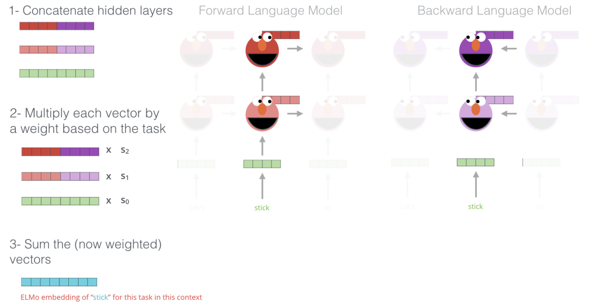
- downstream task: POS tagging 
	- concatenate ELMp embedding with input embedding in downstream task
	- train with the downstream RNN
	- 通常我们不会对 ELMo 中的语言模型进行训练，我们固定其隐藏状态，即双向 LSTM 中的参数，我们要学习的只是 ELMo 中的最后一步加权求和时的权重参数（即之前提到的$s_1$）。在我们的词性标注任务开始时，我们将这些权重设置为一些随机值，然后我们根据任务的表现来更新这些权重
- ELMo performance 
	- SQuAD：一个非常著名的问答数据集（QA
	- SNLI：文本蕴含数据集（textual entailment）
	- SRL：语义角色标注数据集（semantic role labelling）
	- Coref：共指消解数据集（coreference resolution）
	- NER：命名实体识别数据集（named entity recognition）
	- SST-5：情感分析数据集（sentiment analysis)
- findings
	- Lower layer representation = captures syntax
		- good for POS tagging, NER
	- Higher layer representation = captures semantics
		- good for QA, textual entailment, sentiment analysis
- contextual vs. non-contextual 
	- Non-contextual only find similar words
	- Contextual find similar sentences, where the target word has similar meaning
	- contextual embedding doog in word sense disambiguation
- disadvantages of contextual embeddings
	- Difficult to do intrinsic evaluation (e.g. word similarity, analogy)
	- Interpretability
	- Computationally expensive to train large-scale contextual embeddings

### Bidirectional Encoder Representations from Transformers (BERT)
- disadvantages of RNNs
	- Sequential processing: difficult to scale to very large corpus or models
	- RNN language models run left to right (capturesonly one side of context)
	- Bidirectional RNNs help, but they only capture surface bidirectional representations (no interaction between forward and backward language model, simple concatenation) 
- BERT
	- Uses self-attention networks (aka Transformers) to capture dependencies between words
		- No sequential processing (easier to scale to large corpus)
	- Masked language model objective to capture deep bidirectional representations (forward and backward not independent)
	- Loses the ability to generate language
	- Not an issue if the goal is to learn contextual representations
	- BERT vs. ELMo 
		- In ELMo, no interaction between forward and backward model
		- In BERT, Transformer sees all context words of the target word, then calculate an aggregate representation(集合表示).
		- 由于这里我们使用单个模型来捕获两个方向的上下文信息，模型可以捕获到不同的两侧上下文单词之间更深层次的关系。
	- masked language model
		- ‘Mask’ out k% of tokens at random
		- Objective: predict the masked words 
		- use both left and right context to predict 
	- next sentence prediction
		- Learn relationships between sentences
		- Predicts whether sentence B follows sentence A
		- Useful pre-training objective for downstream applications that analyse sentence pairs (e.g. textual entailment)
		- labelling not needed. use neighbouring sentences from corpus as positive samples, and randomly sample sentences as negative samples. 
	- training
		- WordPiece (subword) Tokenisation (like BPE, but WordPiece based on probability rather than frequency)
		- Multiple layers of transformers to learn contextual representations
		- BERT is pretrained on Wikipedia+BookCorpus
		- Training takes multiple GPUs over several days
	- how to use
		- given a pre-trained BERT, continue training (fine-tune) it on downstream tasks
		- Add a classification layer on top of the contextual representations 
		- during fine-tuning, parameters of the whole network are updated
		- use [CLS] representation for downstream tasks
		- example: spam detection  
	- BERT vs. ELMo
		- ELMo provides only the contextual representations
		- Downstream applications has their own network architecture
		- ELMo parameters are fixed when applied to downstream applications
			- Only the weights to combine states from different LSTM layers are learned
		- BERT adds a classification layer for downstream tasks
			- No task-specific model needed
		- BERT updates all parameters during fine-tuning
	- BERT performance 

### Transformers
Use **attention** instead of using RNNs (or CNNs) to capture dependencies between words. An example of using **attention** to capture dependencies between words: 
假设现在我们有一个句子 “$\textit{I made her duck}$”，我们希望计算其中单词 “$\textit{made}$” 的上下文嵌入。我们需要先分别单独观察单词 “$\textit{made}$” 周围的单词，例如，对于单词 “$\textit{I}$”，我们将结合单词 “$\textit{made}$” 和 “$\textit{I}$”，组合得到一个向量（第二层中的亮紫色向量）。这个过程称为 注意力（attention），因为我们这里将注意力放在一个特定单词（“$\textit{I}$”）上。然后，对于第二个单词 “$\textit{her}$” 进行相同的操作，得到一个表征了单词 “$\textit{made}$” 和 “$\textit{her}$” 的复合向量（第二层中的亮黄色向量）。同理，对于最后一个单词 “$\textit{duck}$” 也一样，我们得到一个复合向量（第二层中的桃红色向量）。这三个复合向量分别捕获了单词 “$\textit{made}$” 周围的三个上下文单词。然后，我们对这三个复合向量进行加权求和，得到单词 “$\textit{made}$” 的上下文表示。

这就是注意力机制的核心思想。所以，可以看到，这里并没有涉及序列处理，因为假如现在我们要计算单词 “$\textit{duck}$” 的上下文表示，我们可以直接计算其周围单词的注意力组合，而无需先计算出其前一个单词 “$\textit{her}$” 的上下文表示。实际上，第二层的三个复合向量可以采用**并行方式计算**，因此，这里不涉及序列处理，这也是和基于 RNN 这种序列模型的 ELMo 相比，BERT 能够很好地扩展到大型语料库上的原因。

- self-attention via Query, Key, Value
	- Input:
		- query(查询向量) q (e.g. made ) $\rightarrow$ target word vector
		- key(键向量) k and value(值向量) v (e.g. her) $\rightarrow$ context word vector
	- Query, key and value are all vectors
		- inear projections from embeddings
	- Comparison between **query vector** of target word (made) and **key vectors** of context words to compute weights
	- Contextual representation of **target word** = weighted sum of **value vectors** of **context words and target word**
	- $c_{made}=\color{red}{0.1}v_I+\color{red}{0.5}v_{made}+\color{red}{0.2}v_{her}+\color{red}{0.3}v_{duck}$ 
	- $A(q,K,V)=\sum_i \frac{e^{q\cdot{k_i}}}{\sum_je^{q\cdot{k_j}}}\times{v_i}$
		- $\frac{e^{q\cdot{k_i}}}{\sum_je^{q\cdot{k_j}}}$: softmax (weights of value vectors)
		- $e^{q\cdot{k_i}}$: query and key comparisons
	- if multiple queries, stack them in a matrix to speed up calculation: $A(Q,K,V)=softmax(QK^T)V$
	- Uses scaled dot-product to prevent values from growing too large
		- $A(Q,K,V)=softmax(\frac{QK^T}{\sqrt{d_k}})V$, where $d_k$ is the dimension of query and key vectors
- Multi-Head Attention 
	- Only one attention for each word pair
	- Uses multi-head attention to allow multiple interactions
	- $W_i$: linear projection of Q/K/V for each head
	- 此前我们看到的是，**每一个单词对只有一个注意力（attention）**，例如：对于单词 “$\textit{made}$”，我们在计算注意力时，每次只考虑一个上下文单词（例如：“$\textit{I}$”）。但是，论文作者还提出了一种 多头注意力机制（multi-head attention），就是简单地将这个步骤重复多次以允许多次交互。

	- 这里，我们有查询、键、值向量 $V,K,Q$，然后我们有一个之前提过的经过缩放的点积自注意力层。现在我们所做的就是将这个过程重复多次，这个过程可以并行化。然后，我们将得到的结果进行连接。这意味着我们将允许模型捕获这些单词对之间的不同类别的交互。具体公式如上所示，对于每一个头 $\text{head}_i$，我们进行一次注意力计算 $\text{Attention}(QW_i^{Q},KW_i^{K},VW_i^{V})$。因为有多个头，我们可以多次线性投影所有的查询、键、值向量，所以每一个头 $\text{head}_i$ 都有一个自己的投影矩阵 $W_i$。将计算得到的所有 $\text{head}_i$ 进行连接，然后再进行一次线性投影计算得到多头注意力 $\text{MultiHead}(Q,K,V)$。
- Transformer block 
	- 可以看到，完整的 Transformer 块中还包含看一些其他操作。给定一个输入，我们先对其进行嵌入计算，然后计算查询、键、值向量，并在此基础上计算多头注意力的向量。然后，我们**将之前查询、键、值向量的结果再加入到多头注意力的结果中进行归一化处理**（normalization）。这意味着，我们从注意力网络中得到第一个单词的上下文表示 $T_1$ 后，我们再回过头来将原单词的嵌入 $E_1$ 加入到 $T_1$ 的结果中，这种做法被称为**残差连接（residual connection），其理由是我们不希望模型忽略原单词的嵌入信息**。然后，我们将通过残差连接以及归一化得到的结果喂给一个前馈网络，并再次进行归一化操作。这就是在一个 Transformer 模型中所发生的全部事情。
	- 在输入 Transformer 块之前的位置编码（Positional Encoding）又指的是什么呢？回忆一下，当我们计算注意力（attention）时，例如：我们要计算单词 “$\textit{made}$” 的上下文表示时，我们每次分别独立地将注意力放在上下文单词 “$\textit{I}$”、“$\textit{her}$”、“$\textit{duck}$” 上，**但是对于模型而言，它并不知道单词的位置信息**：即单词 “$\textit{her}$” 是和目标单词 “$\textit{made}$” 相邻的下一个单词，单词 “$\textit{duck}$” 和目标单词 “$\textit{made}$” 的距离要更远一些等等。所以，**位置编码实际上是一个向量，它编码了文本中单词的一些位置信息**，例如：单词 “$\textit{duck}$” 出现在文本中的第 4 个位置，单词 “$\textit{her}$” 出现在第 3 个位置等等。因此，位置编码为模型提供了一些词序相关的信息。

### Conclusion
- Contextual representations are very useful
- Pre-trained on very large corpus
	- Learned some knowledge about language
	- Uses unsupervised objectives
- When we use them for downstream tasks, we are no longer starting from “scratch”

## Lecture 12 Discourse
So far, most tasks/models we learned operate at word or sentence level. But NLP often deals with documents
**Discourse**: understanding how sentences relate to each other in a document
### Discourse segmentation
- A document can be viewed as a sequence of segments
- A segment: a span of cohesive(连贯的) text
- Cohesion(连贯性): organised around a topic or function
	- Wikipedia biographies: early years, major events, impact on others
	- Scientific articles: introduction, related work, experiments
- unsupervised approaches
	- TextTiling algorithm: looking for points of low lexical cohesion between sentences
	- For each sentence gap:
		- Create two BOW vectors consisting of words from *k* sentences on either side of gap
		- Use cosine to get a similarity score (sim) for two vectors
		- For gap i, calculate a depth score, insert boundaries when depth is greater than some threshold *t*
		- $depth(gap_i)=(sim_{i-1}-sim_i)+(sim_{i+1}-sim_i)$
		- example: 
- supervised approaches
	- get labelled data from easy souces
		- scientific publications
		- Wikipedia articles 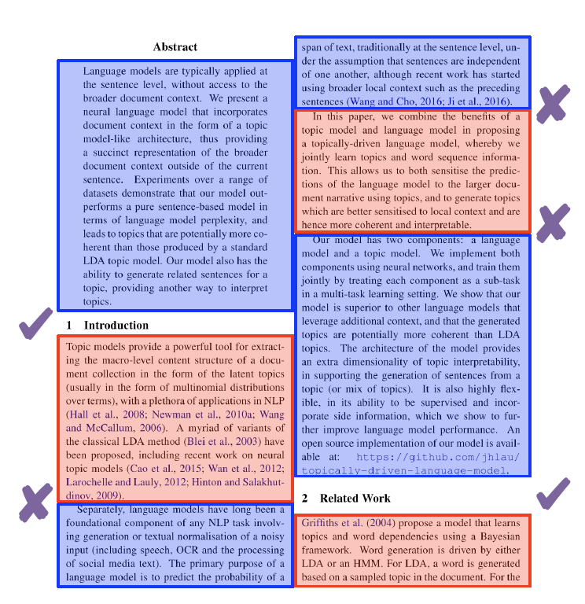
	- Apply a binary classifier to identify boundaries
	- Or use sequential classifiers
	- Potentially include classification of section types (introduction, conclusion, etc.)
	- Integrate a wider range of features, including
		- distributional semantics
		- discourse markers (therefore, and, etc): 语篇标记在这里要更加重要一些，因为它们通常对于语篇分段前后的差异具有放大效应。

### Discourse Parsing
- Identify discourse units(语篇单元), and the relations that hold between them
- Rhetorical(修辞) Structure Theory (RST) is a framework to do hierarchical analysis of discourse structure in documents. 在这个文档中，我们一共有 3 个语篇单元，RST 试图在给定这些语篇单元的情况下，发现它们之间所维系的关系。例如：第 2 个从句和第 3 个从句之间存在 让步（Concession）关系，而这两个语篇单元作为整体又和第一个主要句子之间存在 详述（Elaboration）关系。一旦我们构建完成这样一个层级树形结构，我们就可以知道根结点代表的核心语篇单元以及用于支持它的其他语篇单元。
- discourse units
	- Typically clauses(子句) of a sentence
	- DUs do not cross sentence boundary
	- *[It does have beautiful scenery,] [some of the best since Lord of the Rings.]*
	- 2 merged DUs = another composite DU 
- discourse relations
	- Relations between discourse units
	- 连接 (conjuction)，论证 (justify)，让步 (concession)，详述 (elaboration), etc. 
- nucleus(核心) vs. satellite(伴随体)
	- Within a discourse relation, one argument is the nucleus (the primary argument)
	- The supporting argument is the satellite 
	- Some relations are equal (e.g. conjunction), and so both arguments are nuclei(nucleus复数) 
- RST tree
	- an RST relation conbines two or more DUs into composite DUs
	- process of combining DUs is repeated, creating an RST tree 
- RST parsing(解析)
	- given a document, recover the RST tree
		- rule-based parsing
		- bottom-up approach
		- top-down approach
	- using discourse markers
		- Some discourse markers(语篇标记) (cue phrases(提示语)) explicitly indicate relations
			- although, but, for example, in other words, so, because, in conclusion,…
		- Can be used to build a simple rule-based parser
		- However
			- Many relations are not marked by discourse marker
				- DUs have some relation, but no explicit discourse markers
			- Many discourse markers ambiguous (e.g. and)
				- sometimes not a discourse marker: "*John and I went fishing*" (connect two nouns, not two DUs)
				- '*and*' can represent *conjunction, reason, justify*
	- using machine learning
		- RST Discourse Treebank
			- 300+ documents annotated with RST trees
			- 创建这些文档的成本非常高并且非常耗时，语言学专家需要现将这些文档分成单个的语篇单元，然后缓慢地迭代合并这些语篇单元来构建一个能够描述整篇文档的完整 RST 树。(time-consuming to construct)
		- Basic idea:
			- Segment document into DUs
			- Combine adjacent DUs into composite DUs iteratively to create the full RST tree (bottom-up parsing)
			- 这里我们有一个非常简单的文档，它包含 4 个句子。首先，我们构建一个 EDU 分段器，将该文档划分为 4 个 EDUs。然后，我们再构建一个分类器，迭代地对这些 EDUs 进行合并。例如，我们可以自底向上，先对 *EDU-2*和 *EDU-3*进行合并，同时我们还需要预测出两者之间的关系*elab*。然后，我们按照同样的方式，将两者的复合 DU 与*EDU-1*进行合并，并给出新的关系。以此类推，我们可以通过自底向上的方式构建出完整的 RST 树。 
		- bottom-up parsing
			- Transition-based parsing (lecture 16):
				- Greedy, uses shift-reduce algorithm (local optimum)
				- 基于转移的解析可能是语篇解析任务中最常用的方法。该方法是一种贪婪方法，类似于局部分类器，这里每个决策点之间都是独立的，它仅仅选择当前最可能的 EDU 对进行合并，而不会不考虑过去和未来的情况。
			- CYK/chart parsing algorithm (lecture 14)
				- Global, but some constraints prevent CYK from finding globally optimal tree for discourse parsing
				- 该方法要比基于转移的解析方法慢得多，因此，通常在语篇解析任务中，主要采用的方法还是基于转移的解析。
		- top-down parsing
			1. Segment document into DUs
			2. Decide a boundary to split into 2 segments
			3. For each segment, repeat step 2  
		- features
			- bag of words
				- 单词对于语篇解析非常重要。
			- discourse markers
				- 语篇标记也非常重要，像 “however” 这类单词通常显式地表明了语篇单元之间的关系。
			- starting/ending n-grams
				- 通常，我们倾向于在句子开头和结尾使用一些特定的单词短语，它们也包含了一些句子之间逻辑上的转变。
			- location in the text
				- 文本中的句子之间的语篇关系转变有时和句子在文本中的位置有关。
			- syntax features
				- 通常，像词性（part-of-speech）等句法特征通常也包含了一些有用信息。
			- lexical and distributional similarities
				- 单词含义及上下文信息通常也非常有用。
- applications of discourse parsing 
	- Summarisation
		- 当语篇解析刚被提出的时候，主要是用于文本总结任务的：给定一段文本，我们希望找出这段文本想要表达的主要观点。假如我们知道了这边文档的 RST 树，我们就可以知道其中哪些语篇单元是核心，哪些是伴随体，以及它们之间的关系，这样，我们就可以很容易地对文章内容进行总结归纳，因为我们知道作为核心的语篇单元（例如1B）的重要程度总是要比作为伴随体的语篇单元（例如1C）更高。
	- Sentiment analysis
		- 语篇解析的另一个应用场景是情感分析。这里，我们来看一下 RST 树是如何决定这篇文档的情感倾向的。可以看到，我们用绿色标出了这段文本中所有表示正面情感的单词，然后用棕色标出了所有表示负面情感的单词。如果仅仅观察正负情感单词的出现频率，我们可以会认为这段影评表达的是一种正面情感，因为其中出现的大部分都是表示正面情感的单词。但是，如果我们观察这段文本的 RST 树，我们会发现位于根结点的最核心的语篇单元是1H，它对应文本中的最后一个句子，这表明我们在对这段文本进行情感分析时，最后一个句子表达的意思才是整段文本的重点。然后，我们会发现这段文本的情感倾向实际上是负面的。因此，语篇解析中的 RST 树可以帮助我们发现文本中的中心句。
	- Argumentation mining
		- 语篇解析还可以帮助我们进行论据挖掘任务。RST 树可以帮助我们发现文本中用于支持一些观点的论据，例如：RST 树中的*Justify*关系。
	- Authorship attribution
	- Essay scoring

### Anaphora Resolution(指代消解)
- anaphor(照应语)
	- linguistic expressions that refer back to earlier elements in the text
	- Anaphors have a antecedent(先行词) in the discourse, often but not always a noun phrase
		- Yesterday, Ted was late for work. It all started when his car wouldn’t start.
			- '*it*' $\rightarrow$ '*Ted was late for work*'
			- '*his*' $\rightarrow$ '*Ted's*'
	- Pronouns(代词) are the most common anaphor
	- but there are various others
		- Demonstratives(指示代词) (that problem)
- motivations
	- Essential for deep semantic analysis
	- Very useful for QA, e.g., reading comprehension 
- antecedent restrictions
	- Pronouns must agree in **number** with their antecedents
		- *His coworkers were leaving for lunch when Ted arrived. They invited him, but he said no.*
		- 代词 “$\textit{They}$” 是复数形式，因此，其所指代的对象必须是前面句子开头的 “$\textit{His coworkers}$” 而非 “$\textit{Ted}$”。
	- Pronouns must agree in **gender** with their antecedents
		- *Sue was leaving for lunch when Ted arrived. She invited him, but he said no.*
	- Pronouns whose antecedents are the subject of the same syntactic clause must be **reflexive**(反身的) (…self)
		- *Ted was angry at him. [him ≠ Ted]*
		- *Ted was angry at himself. [himself = Ted]*
- antecedent preferences
	- The antecedents of pronouns should be recent(距离近)
		- *He waited for another 20 minutes, but the tram didn’t come. So he walked home and got his bike out of the garage. He started riding it to work.*
		- 上面的句子中，代词 “$\textit{it}$” 存在歧义性，它可能指代前面的 “$\textit{the tram}$”、“$\textit{his bike}$” 或者 “$\textit{the garage}$”。但是，结合上下文单词 “$\textit{riding}$”，我们会发现这里的 “$\textit{it}$” 指代的显然不可能是 “$\textit{the garage}$”。然后对于剩下的 “$\textit{the tram}$” 和 “$\textit{his bike}$”，我们可以认为代词 “$\textit{it}$” 更有可能指代的是 “$\textit{his bike}$”，因为二者的距离更近一些。
	- The antecedent should be salient(突出的位置), as determined by grammatical position
		- Subject(主语) > object(宾语) > argument of preposition(介词主题)
		- *Ted usually rode to work with Bill. He was never late.*
		- 在上面的句子中，第二句中的 “$\textit{He}$” 更有可能指代的是前一句的主语 “$\textit{Ted}$” 而非宾语 “$\textit{Bill}$”，因为在主语在一个句子中的重要程度要高于宾语。
- entities and reference 
	- Discourse 16.1 (left) more coherent(连贯)
	- because pronouns all refer to John consistently, the protagonist(主人公) 
- centering theory
	- A unified account of relationship between discourse structure and entity reference(语篇结构与实体参照之间关系的统一描述。)
		- RST 为我们描述了如何表示这些语篇结构，而中心理论要更进一步，它告诉我们如何将语篇结构中的这些实体和参照联系起来。并且，中心理论为我们提供了一种方式来解释为什么之前例子中的 16.1 的语篇要比 16.2 的语篇更具连贯性。
	- Every utterance(表述) in the discourse is characterised by a set of **entities**, known as **centers**
	- Explains preference of certain entities for ambiguous pronouns
	- For an utterance $U_n$ 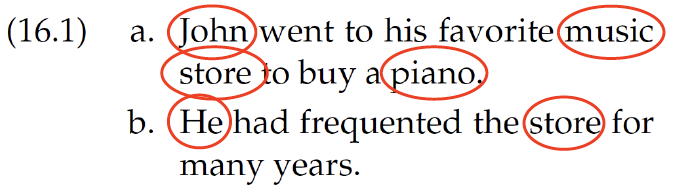
		- **Forward-looking centers**:
			- All entities in Un: $C_f(U_n) = [e1, e2, …]$
			- $C_f(16.1a) = [John, music store, piano]$
			- Ordered by syntactic prominence(句法突出性): subjects > objects
		- **Backward-looking center**:
			- **Highest ranked** forward-looking center in previous utterance $(C_f(U_{n-1}))$ that is also in current utterance $(U_n)$
			- Candidate entities in 16.1b = [John, music store]
			- $C_b(16.1b) = [John]$
			- Not *music store* because *John* has a higher rank in previous utterance’s forward-looking centers $C_f(U_{n-1})$
	- centering algorithm
		- When resolving entity for anaphora resolution, choose the entity such that the **top foward-looking center** matches with the **backward-looking center**
		- why? becausethe text reads more fluent when this condition is satisfied
		- example: 
- supervised anaphor resolution
	- Build a binary classifier for anaphor/antecedent pairs
	- Convert restrictions and preferences into features
		- Binary features for number/gender compatibility
		- Position of antecedent in text
		- Include features about type of antecedent
	- With enough data, **can approximate** the centering algorithm
	- also easy to include features that are potentially helpful
		- words around anaphor/antecedent

### Conlucsion
- For many tasks, it is important to consider context larger than sentences (document segmentation, etc.)
- Traditionally many popular NLP applications has been sentence-focused (e.g. machine translation), but that is beginning to change…

## Lecture 13 Formal Language Theory & Finite State Automata
We learn n-gram language model, hidden Markov model, RNNs, but none of these is fundamentally linguistic.(没有涉及到语言的本质)

### Formal Language Theory
- Studies **classes of languages** and their computational properties
	- Regular language (this lecture)
	- Context free language (next lecture) 
	- A language = set of strings
	- A string = sequence of elements from a finite alphabet (AKA vocabulary) 
	- Goal: solve the **membership problem** by defining its **grammar** $\rightarrow$ whether a string is in a language 
	- some examples of language
		- Binary strings that start with 0 and end with 1
			- { 01, 001, 011, 0001, … } ✓
			- { 1, 0, 00, 11, 100, … } ✗
		- Even-length sequences from alphabet {a, b}
			- { aa, ab, ba, bb, aaaa, … } ✓
			- { aaa, aba, bbb, … } ✗
		- English sentences that start with wh-word and end in ?
			- { what ?, where my pants ?, … } ✓
			- { hello how are you?, why is the dog so cute! } ✗
	- beyond membership problem
		- Membership
			- Is the string part of the language? Y/N
		- Scoring
			- Graded membership
			- “How acceptable is a string?” (language models!)
		- Transduction(转导,转换)
			- “Translate” one string into another (stemming!)

### Regular Language
- The simplest class of languages
-  Any regular expression is a regular language
	- Describes what strings are part of the language (e.g. ‘0(0|1)*1’) 
- operations/definitions in regular expression
	- Symbol drawn from alphabet, $\Sigma$
	- Empty string, $\varepsilon$
	- Concatenation of two regular expressions, RS
	- Alternation of two regular expressions(交替), R|S
	- Kleene star for 0 or more repeats, R*
	- Parenthesis () to define scope of operations
- examlpes of regular languages
	- Binary strings that start with 0 and end with 1
		- $0(0|1)^*1$
	- Even-length sequences from alphabet {a, b}
		- $((aa)|(bb)|(ab)|(ba))^*$
	- English sentences that start with wh-word and end in ?
		- $((what)|(where)|(why)|(which)|(whose)|(whom))\Sigma^*?$
- properties of regular languages
	- **Closure**: if we take regular languages L1 and L2 and merge them, is the resulting language regular? if it is, then this is a closed operation(封闭运算)
	- RLs are closed under the following:
		- **concatenation and union**
		- **intersection**: strings that are valid in both L1 and L2
		- **negation**: strings that are not in L
	- Extremely versatile(通用，全能)! Can have RLs for different properties of language(不同的正则语言来描述语言不同的性质), and use them together

### Finite State Acceptor
 Regualr expression defines a regular language, but does not give an algorithm to check whether a string belongs to the language. $Finite state acceptors (FSA)$ describes the computation involved for membership checking.
 
 - FSA consists
 	- alphabet of input symbols: $\Sigma$
 	- set of state: $Q$
 	- start state: $q_0\in{Q}$
 	- final states: $F\subseteq{Q}$
 	- transition function: $(q_i,symbol)\rightarrow{q_j}$
 - example 
 	- regular expression defined by this FSA: $a^*bb^*$ 
 - derivational morphology
 	- Use of affixes to change word to another grammatical category (* means invalid)
 		- $grace \rightarrow graceful \rightarrow gracefully$
 		- $grace \rightarrow disgrace \rightarrow disgracefully$
 		- $allure \rightarrow alluring \rightarrow alluringly$
 		- $allure \rightarrow ^*allureful$
 		- $allure \rightarrow ^*disallure$
 - FSA for morphology
 	- fairly consisten process, and we want to:
 		- accept valid forms ($grace \rightarrow graceful$)
 		- reject invalid ones ($allure \righarrow ^*allureful$)
 		- generalise to other words e.g. nouns behave like *grace* or *allure* 
 		- collapse or merge states to make FSA to have less states
 - weighted FSA
 	- Some words are more plausible(似乎合理的) than others
 		- *fishful* vs. *disgracelyful*, *fishful* more plausible
 		- *musicky* vs. *writey*, *musicky* more plausible
	- Graded measure of acceptability — weighted FSA changes the following:
		- start state weight function: $\lambda: Q \to \mathbb{R}$
		- final state weight function: $\rho: Q \to \mathbb{R}$
		- transition function: $\delta: (Q,\Sigma,Q) \to \mathbb{R}$
	- WFSA shortest-path
		- total score of a path $\pi = t_1,...,t_N$
			- $\lambda(t_0)+\sum_{i=1}^N\delta(t_i)+\rho(t_N)$, where $t$ is an edge
		- use **shortest-path algorithm** to find $\pi$ with minimum cost
			- $O(VlogV+E)$

### Finite State Transducer
 Often don’t want to just accept or score strings, want to translate them into another string 
 
 - FST add **string output capability**(字符串输出能力) to FSA
 	- includes an **output alphabet**
 	- transitions now take input symbol and **emit(发出) output symbol** ($Q,\Sigma,\Sigma,Q$)
- Can be weighted = WFST
	- Graded scores for transition
- E.g., edit distance(编辑距离) as WFST
	- distance to transform one string to another
- edit distance automata 
- FST for inflectional morphorlogy
	- Verb inflections in Spanish must match the subject in person & number
	- Goal of morphological analysis:
		- canto $\to$ cantar+VERB+present+1P+singular  
- is natural language regualr? $\to$ no! only sometimes: 
	- Length is unbounded, but structure is local
		- (Det Noun Prep Verb)*
		- Can describe with FSA
- non-regular languages
	- Arithmetic expressions with balanced parentheses
		- $(a+(b\times (c/d)))$
		- Can have arbitrarily many opening parentheses
		- Need to remember how many open parentheses, to produce the same number of closed parentheses
		- Can’t be done with finite number of states
	- $a^nb^n$
- center embedding
	- 在自然语言中，还有一种被称为 中心嵌入（Center Embedding）的现象：相关的从句是以中心方式嵌入的
	- Center embedding of relative clauses 
	- Need to remember the *n* subject nouns, to ensure n verbs follow (and that they agree etc)
	- cannot be captured by regular expressions!($S^nV^n$)
	- **Requires (at least) context-free grammar**

### Conclusion
- Concept of a language
- Regular languages
- Finite state automata: acceptors, transducers
- Weighted variants
- Application to edit distance, morphology

## Lecture 14 Context-Free Grammar
- basics of context-free grammars
	- **Symbols**
		- **Terminal**: word such as book
		- **Non-terminal**: syntactic label(句法标签) such as NP or VP
		- convention: lowercase for terminals, uppercase for non-terminals
	- **Productions** (rules)
		- W → X Y Z
		- **Exactly one non-terminal** on left-hand side (LHS)
		- An **ordered** list of symbols on right-hand side (RHS); can be **terminals or non-terminals**
	- Start symbol: **S**
- why is it context-free
	- Production rule depends only on the LHS (and not on ancestors, neighbours)
		- Analogous(相似) to Markov chain
		- Behaviour at each step depends only on current state
- context-free vs. regular
	- context-free more genral and allows recursive(non-terminals can produce themselves) nesting 
- CFG parsing
	- given production rules
		- $S \to aSb$
		- $S \to ab$
	- and a string
		- $aaabbb$
	- produce a valid parse tree 
	- if English can be represented with CFG
		- first develop the production rules
		- then build a 'parser' to automatically judge whether a sentence is grammatical
	- but natural language is not quite context-free: cross-serial dependencies ($a^mb^nc^md^n$) 
	- however, CFG strike a good balance
		- covers most syntactic patterns
		- CFG parsing is computational efficient
	- can use CFG to describe a core fragment of English syntax

### Constituents
- syntactic constituents
	- Sentences are broken into constituents
		- word sequence that function as a **coherent unit** for linguistic analysis
		- helps build CFG production rules
	- Constituents have certain key properties:
		- movement
			- Constituents can be moved around sentences
				- *Abigail gave [her brother] [a fish]*
				- *Abigail gave [a fish] to [her brother]*
			- Contrast: [gave her], [brother a]
		- substitution
			- Constituents can be substituted by other phrases of the same type
				- *Max thanked [his older sister]*
				- *Max thanked [her]*
			- Contrast: [Max thanked], [thanked his]
		- coordination
			- Constituents can be conjoined(结合，连接) with coordinators like and and or
				- [Abigail] and [her young brother] brought a fish
				- Abigail [bought a fish] and [gave it to Max]
				- Abigail [bought] and [greedily ate] a fish
- phrase
	- Once we identify constituents, we use **phrases** to describe them
	- Phrases are determined by their **head word**:
		- noun phrase: her younger **brother**
		- verb phrase: greedily **ate** it
	- can use CFG to formalise these intuitions
- given *'He gave a lecture and away a pie'*, which of the following is a constituent
	- *a lecture* (yes, check movement: '*he gave away a pie and a lecture*')
	- *gave a lecture* (no, chek movement: '*he away a pie and give a lecture*')
	- *a pie* (no, check movement: '*he gave a pie and away a lecture*')
	- *away a pie* (yes, check movement: '*he gave away a pie and a lecture*')
- a simple CFG for English
	- **Terminal symbols**: rat, the, ate, cheese
	- **Non-terminal symbols**: S, NP, VP, DT, VBD, NN
	- **Productions**:
		- S → NP VP
		- NP → DT NN
		- VP → VBD NP
		- DT → the
		- NN → rat
		- NN → cheese
		- VBD → ate
	- generating sentence with the CFG
		- Always start with S (the sentence/start symbol)
			- S
		- Apply a rule with S on LHS (S → NP VP), i.e substitute RHS
			- NP VP
		- Apply a rule with NP on LHS (NP → DT NN)
			- DT NN VP
		- Apply rule with DT on LHS (DT → the)
			- the NN VP
		- Apply rule with NN on LHS (NN → rat)
			- the rat VP
		- Apply rule with VP on LHS (VP → VBD NP)
			- the rat VBD NP
		- Apply rule with VBD on LHS (VBD → ate)
			- the rat ate NP
		- Apply rule with NP on LHS (NP → DT NN)
			- the rat ate DT NN
		- Apply rule with DT on LHS (DT → the)
			- the rat ate the NN
		- Apply rule with NN on LHS (NN → cheese)
			- the rat ate the cheese $\leftarrow$ no non-terminals left! done!
- CFG tree
	- Generation corresponds to a syntactic tree
	- Non-terminals are internal nodes
	- Terminals are leaves
	- CFG parsing is the **reverse** process (sentence → tree) 
- a CFG for arithmetic expressions 
	- S = starting symbol
	- | = operator OR
	- recursive, NUM and S can priduce themselves
	- parsing example: '1+2-3' 

### CYK Algorithm
- use bottom-up parsing to test whether a string is valid given a CFG, without enumerating all possible parses.
- Core idea: form small constituents first, and merge them into larger constituents
- Requirement: CFGs must be in **Chomsky Normal Forms**
- Chomsky Normal Form
	- all rules of form:
		- A $\to$ BC
		- A $\to$ a
	- convert rules of form A $\to$ Bc into:
		- A $\to$ BX
		- X $\to$ c
	- Convert rules A → B C D into:
		- A → B Y
		- Y → C D
		- E.g. VP → VP NP NP for ditransitive(双宾语) cases, “sold [her] [the book]”
	- X, Y are new symbols we have introduced
	- CNF disallows unary rules, A → B.
		- Imagine NP → S; and S → NP … leads to infinitely many trees with same yield.
		- Replace RHS non-terminal with its productions
			- A → B, B → cat, B → dog
			- A → cat, A → dog
- CYK parsing algorithm 
	- Convert grammar to Chomsky Normal Form (CNF)
	- Fill in a parse table (**left to right, bottom to top**)
	- Use table to derive parse
	- **S in top right corner of table** = success!
	- Convert result back to original grammar
	- examlpe:          
	- however, two different results(parse ambiguity). which one is better?
		- the second one is better $\to$ '*eat sushi*' and '*with chopsticks*' more sensible
		- the first one $\to$ '*eat*' and '*sushi with chopsticks*' not sensible

### Representing English with CFGs
For toy grammars (like the example above), we only need handful of production rules good for demonstration or extremely limited domains. However, for real texts, real grammars are needed. Many thousands of production rules!

- key constituents in Penn Treebank
	- Sentence (S)
	- Noun phrase (NP)
	-  Verb phrase (VP)
	-  Prepositional phrase (PP)
	-  Adjective phrase (AdjP)
	-  Adverbial phrase (AdvP)
	-  Subordinate clause (SBAR)
- PTB/0001 example 
- basic English sentence structures
	- Declarative sentences(陈述句) (S → NP VP)
		- The rat ate the cheese
	- Imperative sentences(祈使句，命令句) (S → VP)
		- Eat the cheese!
	- Yes/no questions (S → VB NP VP)
		- Did the rat eat the cheese?
	- Wh-subject-questions (S → WH VP)
		- Who ate the cheese?
	- Wh-object-questions (S → WH VB NP VP)
		- What did the rat eat?
- English noun phrases
	- Pre-modifiers
		- DT, CD, ADJP, NNP, NN
		- E.g. *the two very best Philly cheese steaks*
	- Post-modifiers
		- PP, VP, SBAR
		- *A delivery from Bob coming today that I don’t want to miss*
	- NP → DT? CD? ADJP? (**NN|NNP**)+ PP* VP? SBAR?
- English verb phrases
	- Auxiliaries
		- MD, AdvP, VB, TO
		- E.g *should really have tried to wait*
		- VP → (MD|VB|TO) AdvP? **VP**
	- Arguments and adjuncts
		- NP, PP, SBAR, VP, AdvP
		- E.g *told him yesterday that I was ready*
		- E.g. *gave John a gift for his birthday to make amends*
		- VP → VB NP? NP? PP* AdvP* VP? SBAR?
- other constituents 

### Conclusion
- Context-free grammars can represent most linguistic structures of natural languages
- There are relatively fast dynamic programming algorithms (CYK) to retrieve this structure

## Lecture 15 Probabilisitc Context-Free Grammar
use probabilistic CFG(PCFG) to solve parse ambiguity

### Basics of PCFGs
- Same symbol set:
	- Terminals: words such as book
	- Non-terminal: syntactic labels such as NP or NN
- Same productions (rules)
	- LHS non-terminal → ordered list of RHS symbols
- In addition, store a probability with each production
	- NP → DT NN [p = 0.45]
	- NN → cat [p = 0.02]
	- NN → leprechaun [p = 0.00001]
	- one way to generate probability: use CFGs to parse training data, probabilities based on frequencies of production rules
- Probability values denote **conditional**
	- P(LHS → RHS)
	- P(RHS | LHS)
- Consequently they:
	- must be positive values, between 0 and 1
	- must sum to one for given LHS
- E.g.,
	- NN → aadvark [p = 0.0003]
	- NN → cat [p = 0.02]
	- NN → leprechaun [p = 0.0001]
	- $\sum_xP(NN \to x)=1$
- stochastic generation with PCFGs
	- Almost the same as for CFG, with one twist:
	
	1. Start with S, the sentence symbol
	2. Choose a rule with S as the LHS
		- **Randomly** select a RHS **according to P(RHS | LHS)** e.g., S → VP
		- Apply this rule, e.g., substitute VP for S
	3. Repeat step 2 for each non-terminal in the string (here, VP)
	4. Stop when no non-terminals remain 
	
	- Gives us a tree, as before, with a sentence as the yield 
- how likely is a tree
	- Given a tree, we can compute its probability
		- Decomposes into probability of each production
	- example  
- resolving parse ambiguity
	- select between different trees based on P(T) 
	- the left tree with higher probability is a better tree

### PCFG Parsing
CYK for unweighted grammars(CFGs) finds **all possible trees**, but there are often 1000s, many competely nonsensical. how to solve for **most probable tree**?

- CYK for PCFGs
	- CYK finds all trees for a sentence; we want best tree
	- Prob. CYK follows similar process to standard CYK
	- Convert grammar to Chomsky Normal Form (CNF)
		- VP → Verb NP NP [0.10]
		- VP → Verb NP+NP [0.10] $\Rightarrow$ NP+NP → NP NP [1.0]
		- where NP+NP is a new symbol
	- example:      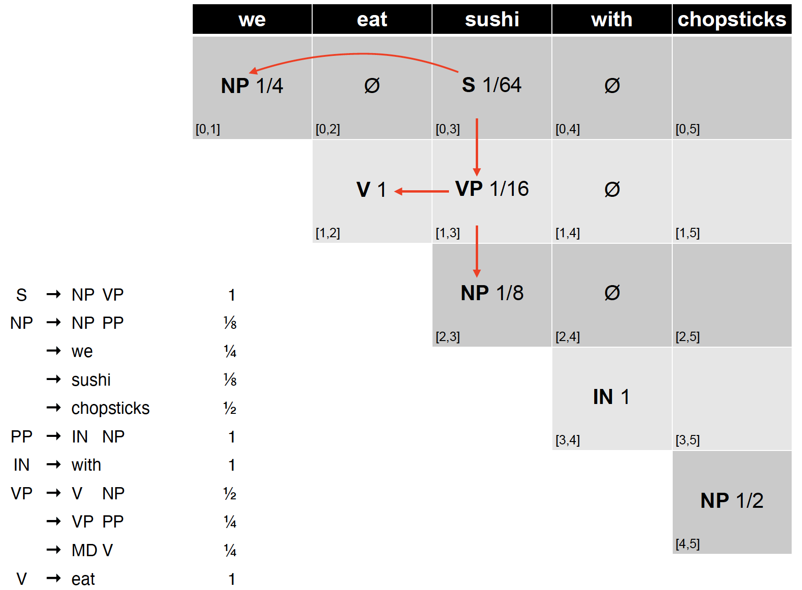      
	- retrieving the parses
		- S in the top-right corner of parse table indicates success
		- Retain back-pointer to best analysis
		- To get parse(s), follow pointers back for each match
		- Convert back from CNF(Chomsky Normal Form) by removing new non-terminals
- prob. CYK vs. CYK 
	- Both CYK and prob. CYK store all possible NTs
	- validity test now looks to see that the child chart cells have non-zero probability
	- Instead of storing set of symbols, store the probability of best scoring tree fragment covering span [i,j] with root symbol A. Overwrite lower scoring analysis if this one is better, and record the best production
	- time complexity in terms of sentence length n: $O(n^3)$ (note: checks with probabilities of multiple productions of LHS is only $O(1)$)

### Limitations of CFG
#### poor independence assumptions
- Rewrite decisions made independently, whereas inter-dependence is often needed to capture global structure.
	- NP → DT NN [0.28] \(the cat)
	- NP → PRP [0.25] \(pronoun)
	- Probability of a rule independent of rest of tree
	- No way to represent this contextual differences in PCFG probabilities 
- NP → PRP should go up to 0.91 as a subject
-  NP → DT NN should be 0.66 as an object
-  Solution: add a condition to denote whether NP is a subject or object
- solution: parent conditioning 
	- Make non-terminals more explicit by incorporating parent symbol into each symbol
	- NP\^S represents subject position (left)
	- NP\^VP denotes object position (right)
	- now change probabilities of production rules

#### Lack of Lexical Conditioning
- Lack of sensitivity to words in tree
- Prepositional phrase (PP) attachment ambiguity
	- *Worker dumped sacks into a bin*
	- attach *into a bin* to *dump* or *sacks*?  
- coordination ambiguity
	- *dogs in houses and cats*
	- *dogs* is semantically a better conjunct for *cats* than *houses* (dogs can’t fit into cats!) 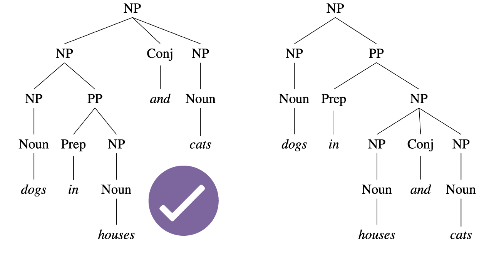
- solution: head lexicalisation
	- Record head word with parent symbols
		- the most salient child of a constituent, usually the noun in a NP, verb in a VP etc
		- VP → VBD NP PP ⇒ VP(dumped) → VBD(dumped) NP(sacks) PP(into) 
	- Incorporate head words into productions, to capture the most important links between words
		- Captures correlations between head words of phrases
		- PP(into): VP(dumped) vs. NP(sacks)
	- problem: grammar symbol inventory **expands massively**!
		- Many of the productions too specific, rarely seen
		- Learning more involved to avoid sparsity problems (e.g., zero probabilities)

### Conclusion
- PCFGs widely used, and there are efficient parsers available.
	- Collins parser, Berkeley parser, Stanford parser
	- All use some form of lexicalisation
- But there are other grammar formalisms
	- Lexical function grammar
	- Head-driven phrase structure grammar
	- Next lecture: dependency grammar!

## Lecture 16 Dependency Grammar
CFGs assume a constituency tree which identifies the **phrases** in a sentence, these phrases are interchangable and maintain grammaticality.

### Dependency Grammars
- Dependency grammar offers a **simpler** approach
	- describe **relations** between pairs of words
	- namely, between **heads** and **dependents** (directed arc!)
	- e.g. (*prefer, dobj, flight*) 
- why dependency grammars
	- Deal better with languages that are morphologically rich and have a relatively free word order
		- CFG need a separate rule for each possible place a phrase can occur in (very rigid)
	- Head-dependent relations similar to semantic relations between words
		- More useful for applications: coreference resolution, information extraction, etc

### Basics of Dependency Grammar
- dependency relations
	- Captures the grammatical relation between two words:
		- **Head** = central word
		- **Dependent** = supporting word
	- Grammatical relation = subject, direct object, etc
	- Many dependency theories and taxonomies(分类学，分类法) proposed for different languages(different languages have different syntatic relations)
	- **Universal Dependency**: a framework to create a set of dependency relations that are computationally useful and **cross-lingual**(跨语言的)(but a bit coarse-grained)
		- example  
		- missing preposition relations, because it is specific to English. expressed in CASE relation.
- question answering
	- Dependency tree more directly represents the core of the sentence: **who did what to whom**?
		- captured by the links incident on verb nodes 
- information extraction
	- “Brasilia, the Brazilian capital, was founded in 1960.”
		- → capital(Brazil, Brasilia)
		- → founded(Brasilia, 1960)
	- Dependency tree captures relations succinctly 
- what about CFGs
	- Constituency trees can also provide similar information
	- But it requires some distilling using head-finding rules 
- dependency vs. constituency
	- Dependency tree
		- each node is a word token
		- one node is chosen as the root(typically the main verb in the sentence)
		- directed edges link heads and their dependents
	- Constituency tree
		- forms a hierarchical tree
		- word tokens are the leaves
		- internal nodes are ‘constituent phrases’ e.g. NP
	- Both use part-of-speech
- properties of a dependency tree
	- Each word has **a single head (parent)**
	- There is **a single root node**
	- There is a **unique path** to each word from the root
	- All arcs should be **projective**
- projectivity
	- An arc is projective if there is a path from head to every word that lies between the head and the dependent 
	- Dependency tree is projective if all arcs are projective
	- In other words, a dependency tree is projective if it can be drawn with **no crossing edges** 
		- arc(*flight,nmod,was*) is not projective! (no path from *flight* to *this, morning*)
	- Most sentences are projective, but **exceptions exist**
		- Common in languages with flexible word order
- Treebank conversion (convert CFG trees to dependency trees)
	- A few dependency treebanks (Czech, Arabic, Danish…)
	- Many constituency treebanks
	- Some can be converted into dependencies
	- Dependency trees generated from constituency trees are **always projective**
	- Main idea: identify head-dependent relations in constituency structure and the corresponding dependency relations
		- Use various heuristics, e.g., head-finding rules
		- Often with manual correction 
	- examples from treebanks
		- Danish DDT includes additional ‘subject’ link for verbs 
		- METU-Sabancı Turkish treebank
			- edges between morphological units, not just words 

### Transition-based Parsing
- dependency parsing
	- Find the best structure for a given input sentence
	- Two main approaches:
		- **Transition-based**: bottom-up greedy method (not global optimal,but dominant approach for quick computation!)
		- **Graph-based**: encodes problem using nodes/edges and use graph theory methods to find optimal solutions(global optimal)
- caveat(警告，说明)
	- Transition-based parsers can only handle **projective** dependency trees!
	- Less applicable for languages where crossdependencies are common
- transition-based parsing: intuition
	- Processes word from left to right
	- Maintain two data structures
	- **Buffer**: input words yet to be processed
	- **Stack**: store words that are being processed 
	- At each step, perform one of the 3 actions:
		- **Shift**: move a word from buffer to stack
		- **Left-Arc**: assign current word as head of the previous word in stack 
		- **Right-Arc**: assign previous word as head of current word in stack 
		- example: 
- dependency labels
	- For simplicity, we omit labels on the dependency relations
	- In practice, we parameterise the left-arc and rightarc actions with dependency labels(a larger set of actions):
		- E.g. left-arc-nsubj or right-arc-dobj
	- Expands the list of actions to > 3 types
- the right action?
	- We assume an **oracle** that tells us the right action at every step
	- Given a dependency tree, the role of oracle is to generate a sequence of ground truth actions 
- parsing model
	- We then train a supervised model to **mimic** the actions of the oracle
		- To learn at every step the correct action to take (as given by the oracle)
		- At test time, the trained model can be used to parse a sentence to create the dependency tree
- parsing as classification
	- Input:
		- Stack (top-2 elements: s1 and s2)
		- Buffer (first element: b1)
	- Output
		- 3 classes: shift, left-arc, or, right-arc
	- Features
		- word (w), part-of-speech (t)
	- example 
- classifiers
	- Traditionally SVM works best
	- Nowadays, deep learning models are state-of-the-art
	- Weakness: local classifier based on **greedy search** (not always give global optimal solution)
	- Solutions:
		- Beam search: keep track of top-N best actions
		- Dynamic oracle: during training, use predicted actions occasionally
		- Graph-based parser

### Graph-based Parsing
- graph-based parsing
	- Given an input sentence, construct a fullyconnected, weighted, directed graph
	- **Vertices**: all words
	- **Edges**: head-dependent arcs
	- **Weight**: score based on training data (relation that is frequently observed receive a higher score)
	- **Objective**: find the maximum spanning tree (largest weight sum, Kruskal’s algorithm)
- advantage
	- Can produce **non-projective** trees
		- Not a big deal for English(don't tend to see non-projective trees in English)
		- But important for many other languages
	- Score entire trees
		- Avoid making greedy local decisions like transition-based parsers
		- Captures long dependencies better
- example
	- Caveat: tree may contain cycles
	- Solution: need to do cleanup to remove cycles (Chu-Liu-Edmonds algorithm) 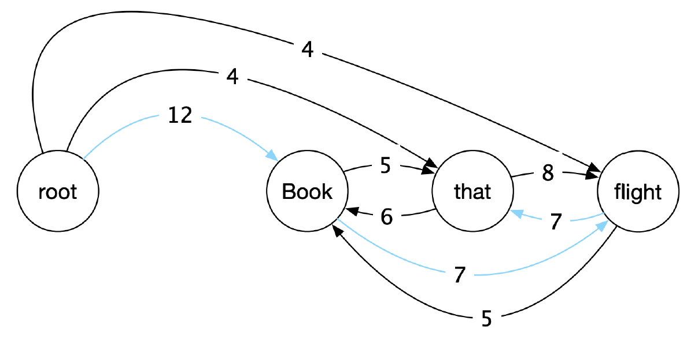
	- maximum spanning tree highlighted in blue

### Conclusion
- Dependency parsing a compelling, alterative, formulation to constituency parsing
	- Edges encode word-word syntactic and semantic relations
- Transition-based parsing
- Graph-based parsing

## Lecture 17 Machine Translation
**Machine translation (MT)** is the task of translating text from one **source language** to another **target language** 

- why?
	- Removes language barrier
	- Makes information in any languages accessible to anyone
	- But translation is a classic “AI-hard” challenge
	- Difficult to preserve the **meaning and the fluency** of the text after translation
- MT is difficult
	- Not just simple word for word translation
	- Structural changes, e.g., syntax and semantics
	- Multiple word translations, idioms(习语，成语，方言)
	- Inflections for gender, case etc
	- Missing information (e.g., determiners) 

### Statistical MT
- earliy MT
	- Started in early 1950s
	- Motivated by the Cold War to translate Russian to English
	- Rule-based system
		- Use bilingual dictionary to map Russian words to English words
	- Goal: translate 1-2 million words an hour within 5 years
- statistical MT
	- Given French sentence *f*, aim is to find the best English sentence *e*
		- $argmax_eP(e|f)$
	- Use Baye’s rule to decompose into two components
		- $argmax_e\color{blue}{P(f|e)}\color{red}{P(e)}$
	- language vs translation model
		- $argmax_e\color{blue}{P(f|e)}\color{red}{P(e)}$
		- $\color{red}{P(e)}$: **language model**
			- learn how to write fluent English text
		- $\color{blue}{P(f|e)}$: **translation model**
			- learns how to translate words and phrases from English to French
	- how to learn LM and TM
		- Language model:
			- Text statistics in large **monolingual(仅一种语言的) corpora** (n-gram models)
		- Translation model:
			- Word co-occurrences in **parallel corpora**
			- i.e. English-French sentence pairs
	- parallel corpora
		- One text in multiple languages
		- Produced by human translation
			- Bible, news articles, legal transcripts, literature, subtitles
			- Open parallel corpus: http://opus.nlpl.eu/
	- models of translation
		- how to learn $P(f|e)$ from paralell text?
		- We only have sentence pairs; **words are not aligned** in the parallel text
		- I.e. we don’t have word to word translation 
	- alignment
		- Idea: introduce **word alignment** as a latent variable into the model
			- $P(f,a|e)$
		- Use algorithms such as expectation maximisation (EM) to learn (e.g. GIZA++) 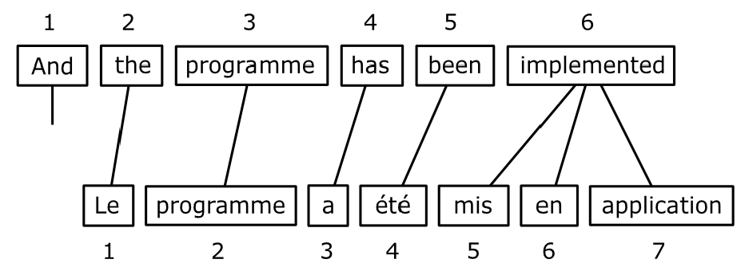
		- complexity
			- some words are dropped and have no alignment 
			- One-to-many alignment 
			- many-to-one alignment 
			- many-to-many alignment 
	- summary
		- A very popular field of research in NLP prior to 2010s
		- Lots of feature engineering
		- State-of-the-art systems are very complex
			- Difficult to maintain
			- Significant effort needed for new language pairs

### Neural MT
- introduction
	- Neural machine translation is a new approach to do machine translation
	- Use a single neural model to directly translate from source to target
	- from model perspective, a lot simpler
	- from achitecture perspective, easier to maintain
	- Requires parallel text
	- Architecture: encoder-decoder model
		- 1st RNN to encode the source sentence
		- 2nd RNN to decode the target sentence 
- neural MT
	- The decoder RNN can be interpreted as a **conditional language model**
		- Language model: predicts the next word given previous words in target sentence y
		- Conditional: prediction is also conditioned on the source sentence *x*
	- $P(y|x)=P(y_1|x)P(y_2|y_1,x)...P(y_t|\color{blue}{y_1,...,y_{t-1}},\color{red}{x})$
	- training
		- Requires parallel corpus just like statistical MT
		- Trains with next word prediction, just like a language model
		- loss 
			- During training, we have the target sentence
			- We can therefore feed the right word from target sentence, one step at a time
	- decoding at test time 
		- But at test time, we don’t have the target sentence (that’s what we’re trying to predict!)
		- **argmax**: take the word with the highest probability at every step
		- exposure bias
			- Describes the discrepancy(差异) between training and testing
			- Training: always have the ground truth tokens at each step
			- Test: uses its own prediction at each step
			- Outcome: model is unable to recover from its own error(error propagation) 
		- greedy decoding
			- argmax decoding is also called greedy decoding
			- Issue: does not guarantee optimal probability $P(y|x)$
		- exhaustive search decoding
			- To find optimal $P(y|x)$, we need to consider every word at every step to compute the probability of all possible sequences
			- $O(V^n)$ where V = vocab size; n = sentence length
			- Far too expensive to be feasible
		- beam search decoding
			- Instead of considering all possible words at every step, consider k best words
			- That is, we keep track of the top-k words that produce the best partial translations (hypotheses) thus far
			- k = beam width (typically 5 to 10)
			- k = 1 = greedy decoding
			- k = V = exhaustive search decoding
			- example:        
		- when to stop
			- When decoding, we stop when we generate <end> token
			- But multiple hypotheses may terminate their sentence at different time steps
			- We store hypotheses that have terminated, and continue explore those that haven’t
			- Typically we also set a maximum sentence length that can be generated (e.g. 50 words)
	- issues of NMT
		- Information of the whole source sentence is represented by a single vector
		- NMT can generate new details not in source sentence
		- NMT tend to generate not very fluent sentences ($\times$, usually fluent, a strength)
		- Black-box model; difficult to explain when it doesn’t work
	- summary
		- Single end-to-end model
			- Statistical MT systems have multiple subcomponents
			- Less feature engineering
			- Can produce new details that are not in the source sentence (hallucination:错觉，幻觉)

### Attention Mechanism
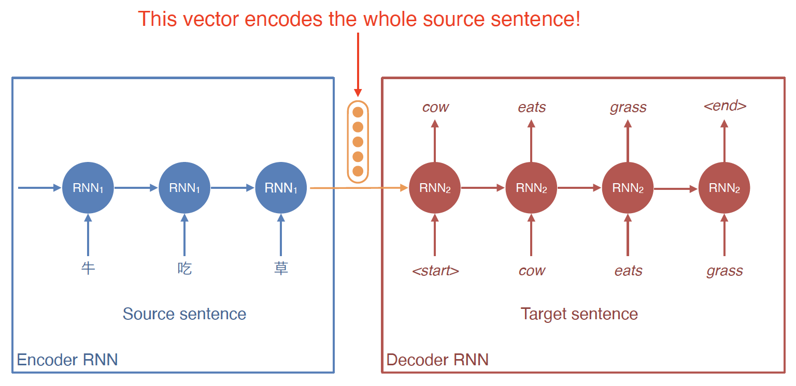

- With a long source sentence, the encoded vector is unlikely to capture all the information in the sentence
- This creates an **information bottleneck**(cannot capture all information in a long sentence in a single short vector)
- attention
	- For the decoder, at every time step allow it to **‘attend’** to words in the source sentence    
	- encoder-decoder with attention 
	- variants
		- attention
			- dot product: $s_t^Th_i$
			- bilinear: $s_t^TWh_i$
			- additive: v^Ttanh(W_ss_t+W_hh_i)
		- $c_t$ can be injected to the current state ($s_t$), or to the input word ($y_t$)
	- summary
		- Solves the information bottleneck issue by allowing decoder to have access to the source sentence words directly(reduce hallucination a bit, direct access to source words, less likely to generate new words not related to source sentence)
		- Provides some form of interpretability (look at attention distribution to see what source word is attended to)
			- Attention weights can be seen as word alignments
		- Most state-of-the-art NMT systems use attention
			- Google Translate (https://slator.com/technology/google-facebook-amazonneural-machine-translation-just-had-its-busiest-month-ever/)

### Evaluation
- MT evaluation
	- BLEU: compute n-gram overlap between “reference” translation(ground truth) and generated translation
	- Typically computed for 1 to 4-gram
		- $BLEU=BP\times exp(\frac{1}{N}\sum_n^Nlogp_n)$, where BP $\to$ "Brevity Penalty" to penalise short outputs
		- $p_n=\frac{\# \  correct \  n-grams}{\# \  predicted \  n-grams}$
		- $BP=min(1,\frac{output \ length}{reference \  length})$

### Conclusion
- Statistical MT
- Neural MT
	- Nowadays use Transformers rather than RNNs
- Encoder-decoder with attention architecture is a general architecture that can be used for other tasks
	- Summarisation (lecture 21)
	- Other generation tasks such as dialogue generation

## Lecture 18 Information Extraction
- information extraction
	- Given this: *“Brasilia, the Brazilian capital, was founded in 1960.”*
	- Obtain this:
		- capital(Brazil, Brasilia)
		- founded(Brasilia, 1960)
	- Main goal: turn text into structured data
- applications
	- Stock analysis
		- Gather information from news and social media
		- Summarise texts into a structured format
		- Decide whether to buy/sell at current stock price
	- Medical research
		- Obtain information from articles about diseases and treatments
		- Decide which treatment to apply for new patient
- how
	- Two steps:
		- **Named Entity Recognition (NER)**: find out entities such as “Brasilia” and “1960”
		- **Relation Extraction**: use context to find the relation between “Brasilia” and “1960” (“founded”)
- machine learning in IE
	- Named Entity Recognition (NER): sequence models such as RNNs, HMMs or CRFs.
	- Relation Extraction: mostly classifiers, either binary or multi-class.
	- This lecture: how to frame these two tasks in order to apply sequence labellers and classifiers.

### Named Entity Recognition
 

- typical entity tags
	- **PER**: people, characters
	- **ORG**: companies, sports teams
	- **LOC**: regions, mountains, seas
	- **GPE**: countries, states, provinces (in some tagset this is labelled as **LOC**)
	- **FAC**: bridges, buildings, airports
	- **VEH**: planes, trains, cars
	- Tag-set is application-dependent: some domains deal with specific entities e.g. proteins and genes
- NER as sequnce labelling
	- NE tags can be ambiguous:
		- “Washington” can be a person, location or political entity
	- Similar problem when doing POS tagging
		- Incorporate context
	- Can we use a sequence tagger for this (e.g. HMM)?
		- No, as entities can span multiple tokens
		- Solution: modify the tag set
	- IO tagging
		- [ORG **American Airlines**], a unit of [ORG **AMR Corp.**], immediately matched the move, spokesman [PER **Tim Wagner**] said.
		- ‘I-ORG’ represents a token that is inside an entity (ORG in this case).
		- All tokens which are not entities get the ‘O’ token (for **outside**).
		- Cannot differentiate between:
			- a single entity with multiple tokens
			- multiple entities with single tokens 
	- IOB tagging
		- [ORG **American Airlines**], a unit of [ORG **AMR Corp.**], immediately matched the move, spokesman [PER **Tim Wagner**] said.
		- B-ORG represents the beginning of an ORG entity.
		- If the entity has more than one token, subsequent tags are represented as I-ORG. 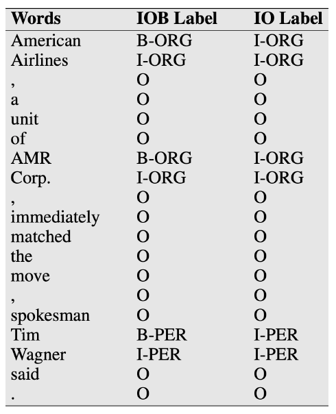
		- example: annotate the following sentence with NER tags(IOB)
			- *Steves Jobs founded Apple Inc. in 1976*, Tageset: PER, ORG, LOC, TIME
	- NER as sequence labelling
		- Given such tagging scheme, we can train any sequence labelling model
		- In theory, HMMs can be used but **discriminative** models such as CRFs are preferred
	- NER
		- features
			- Example: *L’Occitane*
			- Prefix/suffix:
				- L / L’ / L’O / L’Oc / …
				- e / ne / ane / tane / …
			- Word shape:
				- X’Xxxxxxxx / X’Xx
				- XXXX-XX-XX (date!)
			- POS tags / syntactic chunks: many entities are nouns or noun phrases.
			- Presence in a gazeteer: lists of entities, such as place names, people’s names and surnames, etc. 
		- classifier 
		- deep learning for NER
			- State of the art approach uses LSTMs with character and word embeddings (Lample et al. 2016) 

### Relation Extraction
- relation extraction
	- [ORG **American Airlines**], a unit of [ORG **AMR Corp.**], immediately matched the move, spokesman [PER **Tim Wagner**] said.
	- Traditionally framed as triple extraction:
		- unit(American Airlines, AMR Corp.)
		- spokesman(Tim Wagner, American Airlines)
	- Key question: do we know all the possible relations?
		- unit(American Airlines, AMR Corp.) → subsidiary
		- spokesman(Tim Wagner, American Airlines) → employment 
- methods
	- If we have access to a fixed relation database:
		- Rule-based
		- Supervised
		- Semi-supervised
		- Distant supervision
	- If no restrictions on relations:
		- Unsupervised
		- Sometimes referred as “OpenIE”
	- rule-based relation extraction
		- *“Agar is a substance prepared from a mixture of red algae such as Gelidium, for laboratory or industrial use.”*
		- [NP red algae] such as [NP Gelidium]
		- NP0 such as NP1 → hyponym(NP1, NP0)
		- hyponym(Gelidium, red algae)
		- Lexico-syntactic patterns: high precision, low recall, manual effort required
		- more rules 
	- supervised relation extraction
		- Assume a corpus with annotated relations
		- Two steps 
			- First, find if an entity pair is related or not (binary classification)
				- For each sentence, gather all possible entity pairs
				- Annotated pairs are considered positive examples
				- Non-annotated pairs are taken as negative examples
			- Second, for pairs predicted as positive, use a multiclass classifier (e.g. SVM) to obtain the relation
			- example
				- [ORG **American Airlines**], a unit of [ORG **AMR Corp.**], immediately matched the move, spokesman [PER **Tim Wagner**] said.
				- First:
					- (American Airlines, AMR Corp.) → positive
					- (American Airlines, Tim Wagner) → positive
					- (AMR Corp., Tim Wagner) → negative
				- Second:
					- (American Airlines, AMR Corp.) → subsidiary
					- (American Airlines, Tim Wagner) → employment
		- features
			- [ORG **American Airlines**], a unit of [ORG **AMR Corp.**], immediately matched the move, spokesman [PER **Tim Wagner**] said.
			- (American Airlines, Tim Wagner) → employment 
	- semi-supervised relation extraction
		- Annotated corpora is very expensive to create
		- Use seed tuples to bootstrap a classifier
		- steps:
		
			1. Given seed tuple: hub(Ryanair, Charleroi)
			2. Find sentences containing terms in seed tuples
				- *Budget airline* ***Ryanair***, *which uses* ***Charleroi*** *as a hub*, *scrapped all weekend flights out of the airport*
			3. Extract general patterns
				- [ORG], which uses [LOC] as a hub
			4. Find new tuples with these patterns
				- hub(Jetstar, Avalon)
			5. Add these new tuples to existing tuples and repeat step 2
		
		- issues
			- Difficult to create seed tuples
			- Extracted tuples deviate from original relation over time
			- Difficult to evaluate
			- Tend not to find many novel tuples given seed tuples
			- Extracted general patterns tend to be very noisy
		- semantic drift
			- Pattern: [NP] has a {NP}\* hub at [LOC]
			- Sydney has a ferry hub at Circular Quay
				- hub(Sydney, Circular Quay)
			- More erroneous patterns extracted from this tuple…
			- Should only accept patterns with high confidences
		- distant supervision
			- Semi-supervised methods assume the existence of seed tuples to mine new tuples
			- Can we mine new tuples directly?
			- Distant supervision obtain new tuples from a range of sources:
				- DBpedia
				- Freebase 
			- Generate massive training sets, enabling the use of richer features, and no risk of semantic drift
	- unsupervised relation extraction
		- No fixed or closed set of relations
		- Relations are sub-sentences; usually has a verb
		- “United has a hub in Chicago, which is the headquarters of United Continental Holdings.”
			- “has a hub in”(United, Chicago)
			- “is the headquarters of”(Chicago, United Continental Holdings)
		- Main problem: mapping relations into canonical forms
	- evaluation
		- NER: F1-measure at the entity level.
		- Relation Extraction with known relation set: F1-measure
		- Relation Extraction with unknown relations: much harder to evaluate
			- Usually need some human evaluation
			- Massive datasets used in these settings are impractical to evaluate manually (use samples)
			- Can only obtain (approximate) precision, not recall

### Other IE Tasks
- temporal expression extraction

	“[TIME **July 2, 2007**]: A fare increase initiated [TIME **last week**] by UAL Corp’s United Airlines was matched by competitors over [TIME **the weekend**], marking the second successful fare increase in [TIME **two weeks**].”
	
	- **Anchoring**: when is “last week”?
		- “last week” → 2007−W26
	- **Normalisation**: mapping expressions to canonical forms.
		- July 2, 2007 → 2007-07-02
	- Mostly rule-based approaches
- event extraction
	- “American Airlines, a unit of AMR Corp., immediately [EVENT **matched**] [EVENT **the move**], spokesman Tim Wagner [EVENT **said**].”
	- Very similar to NER, including annotation and learning methods.
	- Event ordering: detect how a set of events happened in a timeline.
	- Involves both event extraction and temporal expression extraction.

### Conclusion
- Information Extraction is a vast field with many different tasks and applications
	- Named Entity Recognition
	- Relation Extraction
	- Event Extraction
- Machine learning methods involve classifiers and sequence labelling models.

## Lecture 19 Question Answering
### introduction
- Definition: question answering (“QA”) is the task of automatically determining the answer for a natural language question
- Mostly focus on “factoid” questions
- factoid question
	- Factoid questions, have short precise answers:
		- What war involved the battle of Chapultepec?
		- What is the date of Boxing Day?
		- What are some fragrant white climbing roses?
		- What are tannins?
- non-factoid question
	- General non-factoid questions require a longer answer, critical analysis, summary, calculation and more:
		- Why is the date of Australia Day contentious?
		- What is the angle 60 degrees in radians?
- why focus on factoid questions
	- They are easier
	- They have an objective answer
	- Current NLP technologies cannot handle non-factoid answers
	- There’s less demand for systems to automatically answer non-factoid questions
- 2 key approaches
	- Information retrieval-based QA
		- Given a query, search relevant documents
		- Find answers within these relevant documents
	- Knowledge-based QA
		- Builds semantic representation of the query
		- Query database of facts to find answers

### IR-based QA
- IR-based factoid QA: TREC-QA 
	1. Use question to make query for IR engine
	2. Find document, and passage within document
	3. Extract short answer string
- question processing
	- Find key parts of question that will help retrieval
		- Discard non-content words/symbols (wh-word, ?, etc)
		- Formulate as tf-idf query, using unigrams or bigrams
		- Identify entities and prioritise match
	- May reformulate question using templates
		- E.g. “Where is Federation Square located?”
		- Query = “Federation Square located”
		- Query = “Federation Square is located [in/at]”
	- Predict expected answer type (here = LOCATION)
- answer types
	- Knowing the type of answer can help in:
		- finding the right passage containing the answer
		- finding the answer string
	- Treat as classification
		- given question, predict answer type
		- key feature is question headword
		- *What are the animals on the Australian coat of arms*?
		- Generally not a difficult task  
- retrieval
	- Find top n documents matching query (standard IR)
	- Next find passages (paragraphs or sentences) in these documents (also driven by IR)
	- Should contain:
		- many instances of the question keywords
		- several named entities of the answer type
		- close proximity of these terms in the passage
		- high ranking by IR engine
	- Re-rank IR outputs to find best passage (e.g., using supervised learning)
- answer extraction
	- Find a concise answer to the question, as a span in the passage
		- “Who is the federal MP for Melbourne?”
		- *The Division of Melbourne is an Australian Electoral Division in Victoria, represented since the 2010 election by _Adam Bandt_, a member of the Greens.*
		- “How many Australian PMs have there been since 2013?”
		- *Australia has had _five_ prime ministers in five years. No wonder Merkel needed a cheat sheet at the G-20.*
- how?
	- Use a neural network to extract answer
	- AKA reading comprehension task
	- But deep learning models require lots of data
	- Do we have enough data to train comprehension models?
- MCTest
	- Crowdworkers write fictional stories, questions and answers
	- 500 stories, 2000 questions
	- Multiple choice questions 
- SQuAD
	- Use Wikipedia passages
	- First set of crowdworkers create questions (given passage)
	- Second set of crowdworkers label the answer
	- 150K questions (!)
	- Second version includes unanswerable questions 
- reading comprehension
	- Given a question and context passage, **predict where the answer span starts and end in passage**?
	- Compute:
		- $P_{start}(i)$: prob. of token i is the starting token
		- $P_{end}(i)$: prob. of token i is the ending token 
- LSTM-based model
	- Feed question tokens to a bidirectional LSTM
	- Aggregate LSTM outputs via weighted sum to produce *q*, the final q question embedding 
	- Process passage in a similar way, using another bidirectional LSTM
	- More than just word embeddings as input
		- A feature to denote whether the word matches a question word
		- POS feature
		- Weighted question embedding: produced by attending to each question words 
	- {$p_1,...,p_m$}: one vector for each passage token from bidirectional LSTM
	- To compute start and end probability for each token
		- $p_{start}(i) \propto exp(p_iW_sq)$
		- $P_{end}(i) \propto exp(p_iW_eq)$ 
- BERT-based model
	- Fine-tune BERT to predict answer span
		- $p_{start}(i) \propto exp(S^TT_i')$
		- $p_{end}(i) \propto exp(E^TT_i')$ 
