# NLP Tuts
## Week 1
- What is tokenisation and why is it important?
	- Tokenisation is the act of transforming a (long) document into a set of meaningful substrings, so that we can compare with other (long) documents.
	- In general, a document is too long — and contains too much information — to manipulate directly. There are some counter-examples, like language identification, which we need to perform before we decide how to tokenise anyway.
- What are stemming and lemmatisation, and how are they different?
	- Both stemming and lemmatisation are mechanisms for transforming a token into a canonical (base, normalised) form. For example, turning the token walking into its base form walk.
	- Both operate by applying a series of rewrite operations to remove or replace (parts of) affixes (primarily suffixes). (In English, anyway.)
	- However, **lemmatisation works in conjunction with a lexicon**: a list of valid words in the language. The goal is to turn the input token into an element of this list (a valid word) using the rewrite rules. If the re-write rules can’t be used to transform the token into a valid word, then the token is left alone. (For example, the token lemming wouldn’t be transformed into lemm because the latter isn’t in the word list.)
	- **Stemming simply applies the rewrite rules, even if the output is a garbage token (like lemm).**
	- One further idea is the difference between inflectional morphology and derivational morphology:
		- Inflectional morphology is the systematic process (in many but not all languages) by which tokens are altered to conform to certain grammatical constraints: for example, if the English noun teacher is plural, then it must be represented as teachers. The idea is that these changes don’t really alter the meaning of the term. Consequently, **both stemming and lemmatisation attempt to remove this kind of morphology**.
		- Derivational morphology is the (semi-)systematic process by which we transform terms of one class into a different class. For example, if we would like to make the English verb teach into a noun (someone who performs the action of teaching), then it must be represented as teacher. This kind of morphology tends to produce terms that differ (perhaps subtly) in meaning, and the two separate forms are usually both listed in the lexicon. Consequently, **lemmatisation doesn’t usually remove derivational morphology in its normalisation process, but stemming usually does.**

## Week 2
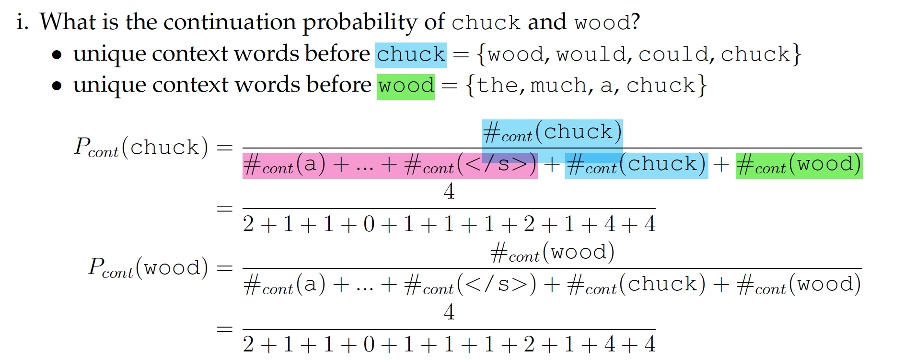

## Week 3
- What is a **POS tag**?
	- A POS tag, AKA word classes, is a label assigned to a word token in a sentence which indicates some grammatical (primarily syntactic) properties of its function in the sentence.
- What are some common approaches to POS tagging? What aspects of the data might allow us to predict POS tags systematically?
	- **Unigram**: Assign a POS tag to a token according to the most common observation in a tagged corpus; many words are unambiguous, or almost unambiguous.
	- **N-gram**: Assign a POS tag to a token according to the most common tag in the same sequence (based on the sentence in which the token occurs) of n tokens (or tags) in the tagged corpus; context helps disambiguate.
	- **Rule-based**: Write rules (relying on expertise of the writer) that disambiguate unigram tags.
	- **Sequential**: Learn a Hidden Markov Model (or other model) based on the observed tag sequences in a tagged corpus.
	- **Classifier**: Treat as a supervised machine learning problem, with tags from a tagged corpus as training data.
- What are the **assumptions that go into a Hidden Markov Model**? What is the time complexity of the **Viterbi algorithm**? Is this practical?
	- **Markov assumption**: the likelihood of transitioning into a given state depends only on the current state, and not the previous state(s) (or output(s))
	- **Output independence assumption**: the likelihood of a state producing a certain word (as output) does not depend on the preceding (or following) state(s) (or output(s)).
	- The time complexity of the Viterbi algorithm, for an HMM with T possible states, and a sentence of length W, is O(T2W). In POS tagging, there might typically be approximately 100 possible tags (states), and a typical sentence might have 10 or so tokens, so ... yes, it is practical (unless we need to tag really, really, quickly, e.g. tweets as they are posted).
- how can the **initial state probabilities** $\pi$ be esitmated
	- Record the distribution of tags for the first token of each sentence in a tagged corpus.
- How can the **transition probabilities** A be estimated?
	- For each tag, record the distribution of tags of the immediately following token in the tagged corpus. (We might need to introduce an end–of–sentence dummy for the probabilities to add up correctly.)
- How can the **emission probabilities** B be estimated?
	- For each tag, record the distribution of corresponding tokens in the tagged corpus.
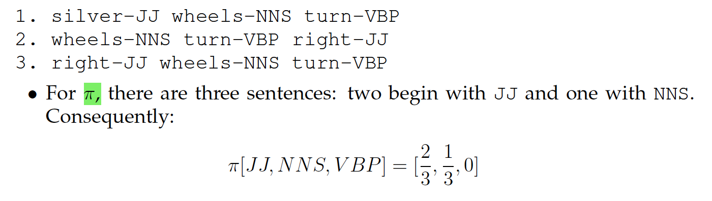 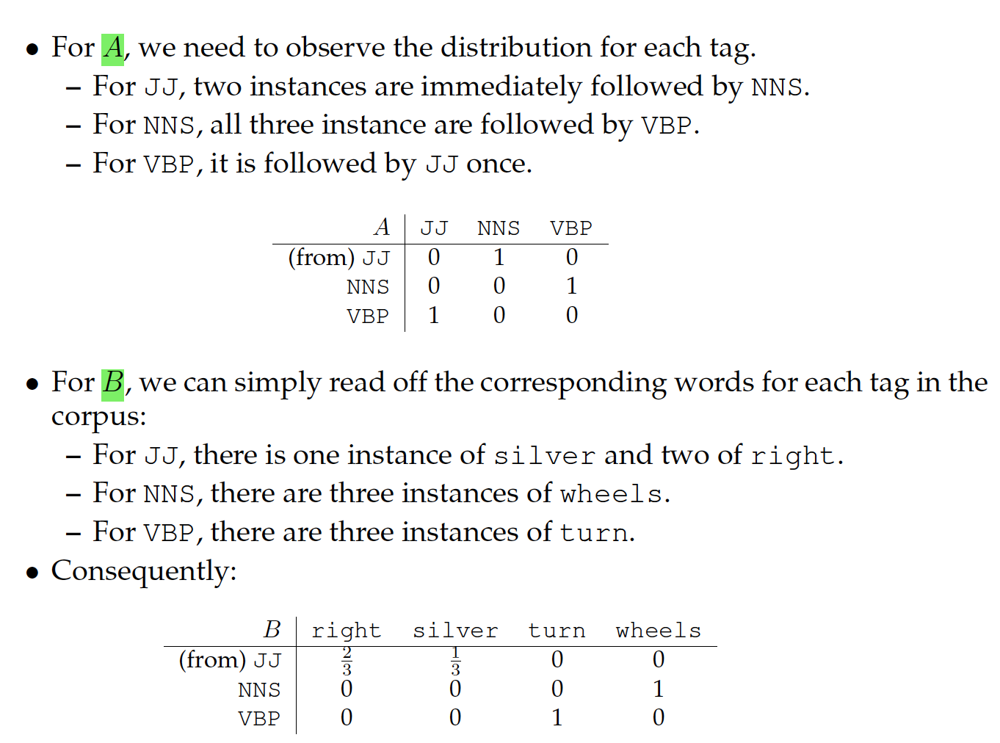 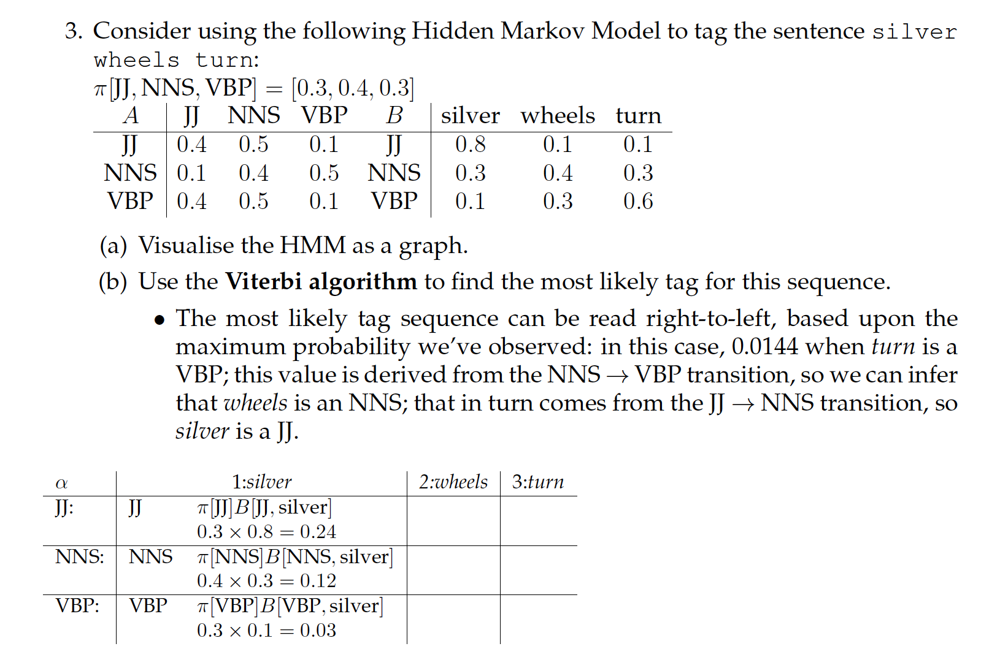 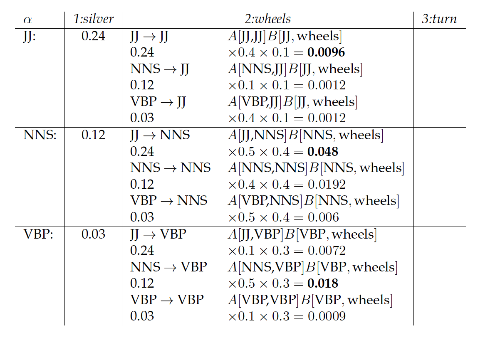

## Week 4
- How does a neural network language model (feedforward or recurrent) **handle a large vocabulary**, and how does it **deal with sparsity** (i.e. unseen sequences of words)?
	- A neural language model projects words into a continuous space and **represents each word as a low dimensional vector** known as **word embeddings**. These word embeddings **capture semantic and syntactic relationships between words**, allowing the model to generalise better to unseen sequences of words.
	- For example, having seen the sentence the cat is walking in the bedroom in the training corpus, the model should understand that a dog was running in a room is just as likely, as (the, a), (dog, cat), (walking, running) have similar semantic/ grammatical roles.
	- Count-based N-gram language model would struggle in this case, as (the, a) or (dog, cat) are distinct word types from the model’s perspective.

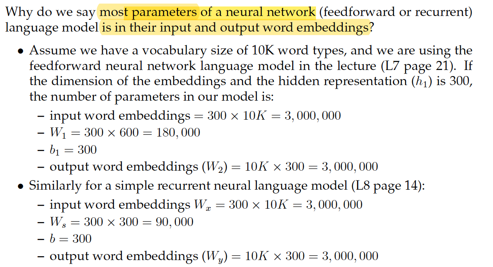 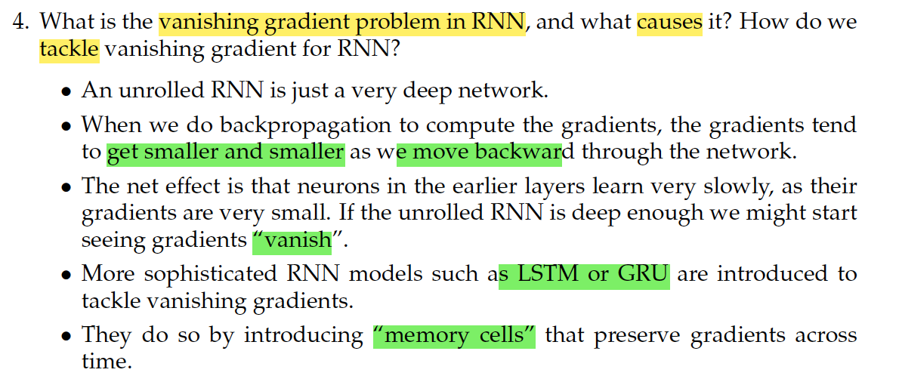

## Week 5
- **Synonyms and hypernyms**
	- Two words are synonyms when they share (mostly) the same meaning, for example: snake and serpent are synonyms.
	- One word is a hypernym of a second word when it is a more general instance (“higher up” in the hierarchy) of the latter, for example, reptile is the hypernym of snake (in its animal sense).
- **Hyponyms and meronyms**
	- One word is a hyponym of a second word when it is a more specific instance (“lower down” in the hierarchy) of the latter, for example, snake is one hyponym of reptile. (The opposite of hypernymy.)
	- One word is a meronym of a second word when it is a part of the whole defined by the latter, for example, scales (the skin structure) is a meronym of reptile.

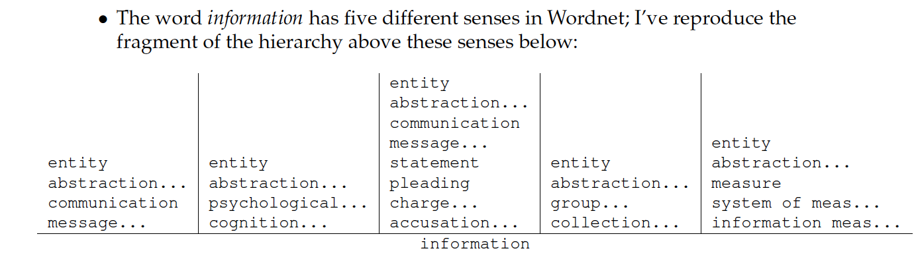 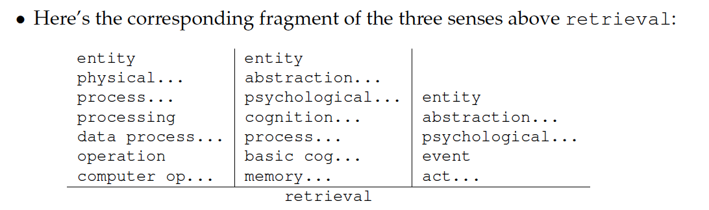 

- what is word sense disambiguation
	- Word sense disambiguation is the computational problem of automatically determining which sense (usually, Wordnet synset) of a word is intended for a given token instance with a document.

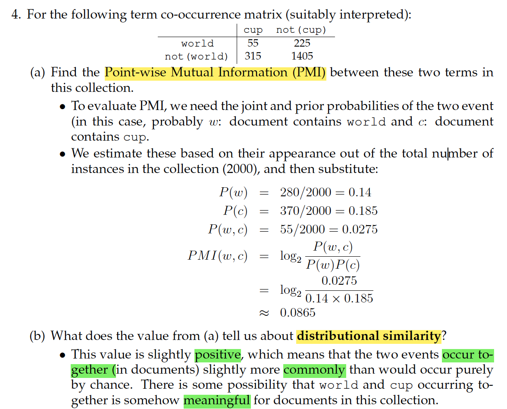

- What is the **Singular Value Decomposition (SVD)** method used for here? Why is this helpful?
	- We are using the SVD method to build a representation of our matrix which can be used to identify the most important characteristics of words.
	- By throwing away the less important characteristics, we can have a smaller representation of the words, which will save us (potentially a great deal of) time when evaluating the cosine similarities between word pairs.
- What is a **word embedding** and how does it relate to **distributional hypothesis**?
	- We’re going to have a representation of words (based on their contexts) in a vector space, such that other words “nearby” in the space are similar
	- This is broadly the same as what we expect in distributional similarity ( “you shall know a word by the company it keeps.”)
	- The row corresponding to the word in the relevant (target/context) matrix is known as the “embedding”.

## Week 6
- What are **contextual representations**?
	- The contextual representation of a word is a representation of the word based on a particular usage. It captures the different senses or nuances of the word depending on the context.
	- Contextualised representations are different to word embeddings (e.g.Word2Vec) which gives a single representation for every word type.
	- Contextual representations that are pre-trained on large data can be seen as a model that has obtained fairly comprehensive knowledge about the language.
- How does a **transformer** captures dependencies between words? What advantages does it have compared to RNN?
	- Transformer uses **attention** to capture dependencies between words.
	- For each target word in a sentence, transformer attends to every other words in the sentence to create its contextual embeddings.
	- As the computation of the contextual embeddings of a target word is independent to other target words, we can **parallelise the computation**. This is an important distinction to RNN, which rely on sequential processing: the contextual embedding of the current target word cannot be computed until we have processed the previous word.
	- This allows transformer-based models to scale to very large data that is difficult for RNN-based models.
- What is **discourse segmentation**? What do the segments consist of, and what are some methods we can use to find them?
	- In Discourse Segmentation, we try to divide up a text into discrete, cohesive units based on sentences.
	- By interpretting the task as a boundary–finding problem, we can use rule– based or unsupervised methods to find sentences with little lexical overlap (suggesting a discourse boundary). We can also use supervised methods, by training a classifier around paragraph boundaries.

## Week 7
- What are **regular grammar** and **regular language**? How are they different?
	- A language is a set of acceptable strings and a grammar is a **generative description** of a language.
	- Regular language is a formal language that can be expressed using a regular expression.
	- Regular grammar is a formal grammar defined by a set of productions rules in the form of A$\to$xB, A$\to$x and A$\to \epsilon$ , where A and B are non-terminals, x is a terminal and $\epsilon$ is the empty string.
	- A language is regular if and only if it can be generated by a regular grammar. For example: A simple regular grammar
		- Rules: S$\to$ A, A$\to$ aA, A$\to \epsilon$  
		- S is the start symbol
		- It will generate words such as a, aa, aaa, aaa.
		- The set of words generated by this regular grammar is a regular language.
		- This regular language **can also be expressed in regular expression** (a)*.
- Regular languages are $$closed under union, intersection and concatenation$$. What does it mean? Why is it important?
	- This means that if L1 and L2 are two regular languages, then L1 [ L2, L1 \ L2, and the language strings that are the concatenation of L1 and L2 are also regular languages.
	- This closure property allows us to apply operations on regular languages to produce a regular language.
	- This allows for NLP problems to be factored into small simple parts, such that we can **develop regular languages for each part, and combine them into a complex system to handle the NLP problems**. This is particularly relevant for transducers and the composition operation, which are used in many NLP pipelines. (Note that FSTs implement “regular relations” rather that regular languages.

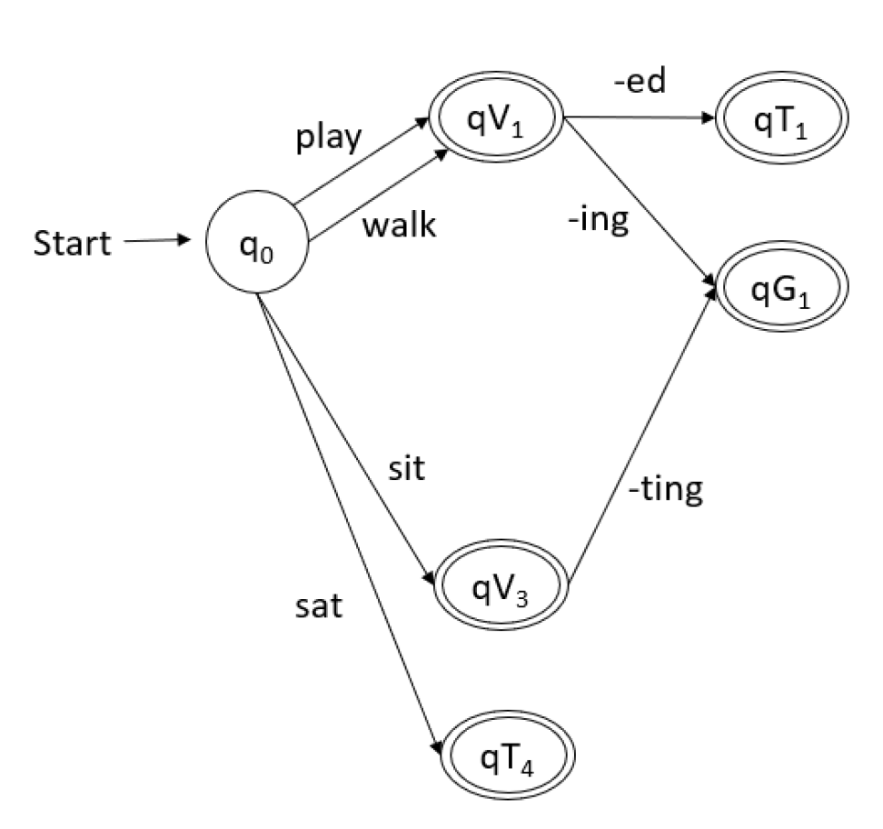

- What are **Weighted Finite State Acceptors (WFSAs)**? When and why are they useful?
	- WFSAs are **generalizations of FSAs**, with each path assigned a score, computed from the transitions, the initial state, and the final state. The total score for any path is equal to the sum of the scores of the initial state, the transitions, and the final state.
	- WFSAs can produce a score for each valid word for sub-word decomposition problems or sentence for words-in-sentence problems, while FSAs have no way to express preferences among technically valid words or sentences.
	- For example, WFSAs can assign scores to all strings of characters forming words, so that spelling mistakes, new words, or strange-but-acceptable words can still be handled.
	- The same argument holds for sequences of words forming sentences. Clearly some word sequences are gibberish, but being able to provide a numerical score can help in many applications, like how LMs can be used in sentence generation, speech recognition, OCR, translation, etc.
- what is parsing
	- Parsing in general is the process of identifying the structure(s) of a sentence, according to a grammar of the language.

## Week 8
- What differentiates **probabilistic CYK parsing from CYK parsing**? Why is this important? How does this affect the algorithms used for parsing?
	- Parsing in general is the process of identifying the structure(s) of a sentence, according to a grammar of the language.
	- In general, the search space is too large to do this efficiently, so we use a dynamic programming method to keep track of partial solutions. The data structure we use for this is a chart in CYK, where entries in the chart correspond to partial parses (licensed structures) for various spans (sequences of tokens) within the sentence. **Probabilistic CYK parsing adds real-valued weights (probability) to each production in the grammar, such that parse trees can be assigned a score, namely the product of the probabilities of the productions in the tree**. This is important as it allows for discrimination between likely and unlikely parses, rather than just provide a list of all parses, as in standard CYK parsing. This affects the algorithms as they need to track the maximum probability analysis for each span, rather than the set of grammar symbols. However the parsing algorithms are very closely related.
- What is a **probabilistic context-free grammar** and what problem does it attempt to solve?
	- A probabilistic context-free grammar adds real-valued weights (probability) to each production in the context-free grammar. This attempts to provide a “language model”, that is, describe the likely sentences in a language, which is facilitated by their grammatical structure.
- In what ways is (transition–based, probabilistic) **dependency parsing similar to (probabilistic) CYK parsing**? In what ways is it different?
	- The connections are a little tenuous, but let’s see what we can come up with:
		- Both methods are attempting to determine the structure of a sentence;
		- both methods are attempting to disambiguate amongst the (perhaps many) possible structures licensed by the grammar by using a probabilistic grammar
		- to determine the most probable structure.
		- Both methods process the tokens in the sentence one–by–one, left–to– right.
	- There are numerous differences (probably too many to enumerate here), for example:
		- Although POS tags are implicitly used in constructing the “oracle” (training), the depedency parser doesn’t explicitly tag the sentence.
		- The dependency parser can potentially take into account other (non–local) relations in the sentence, whereas CYK’s probabilities depend only on the (local) sub-tree.
		- CYK adds numerous fragments to the chart, which don’t end up getting used in the final parse structure, whereas the transition–based dependency parser only adds edges that will be in the final structure.

## Week 9
- What aspects of human language make **automatic translation difficult**? 
	- The whole gamut of linguistics, from lexical complexity, morphology, syntax, semantics etc. In particular if the two languages have very
different word forms (e.g., consider translating from an morphologically light language like English into Turkish, which has very complex morphology), or very different syntax, leading to different word order. These raise difficult learning problems for a translation system, which needs to capture these differences in order to learn translations from bi-texts, and produce these for test examples.
- What is **Named Entity Recognition** and why is it difficult? What might make it more difficult for persons rather than places, and vice versa?
	- We want to find named entities — mostly proper nouns, but also sometimes times or numerical values of significance — within a document.
Often context (which is not always present within the sentence, or even the document!) is needed to disambiguate the type of named entity, or even whether a given phrase is a named entity at all.
	- One common problem, that we see with both people’s names and places, is that they are ambiguous with common nouns. Generally speaking, we
can write a (somewhat) exhaustive list of names of places — a gazetteer — but we can’t with names of people, which are constantly changing. On the other hand, locations can also be quite ambiguous, e.g. “New York” in “New York Times” is less of a location than an organisation.

## Week 10
- What is **semantic parsing**, and why might it be desirable for QA? Why might approaches like NER be more desirable?
	- As opposed to syntactic parsing — which attempts to define the structural relationship between elements of a sentence — we instead want to define the (meaning–based) relations between those elements.
	- For example, in the sentence Donald Trump is president of the United States. we can deduce that Donald Trump is the subject of the verb is, and so on, but in semantic parsing, we might be trying to generate a logical relationship like is(Donald Trump, president(United States)).
	- This format allows us to answer questions like “Who is president of the United States?” by generating an equivalent representation like: is(?,president(United States))

## Week 11
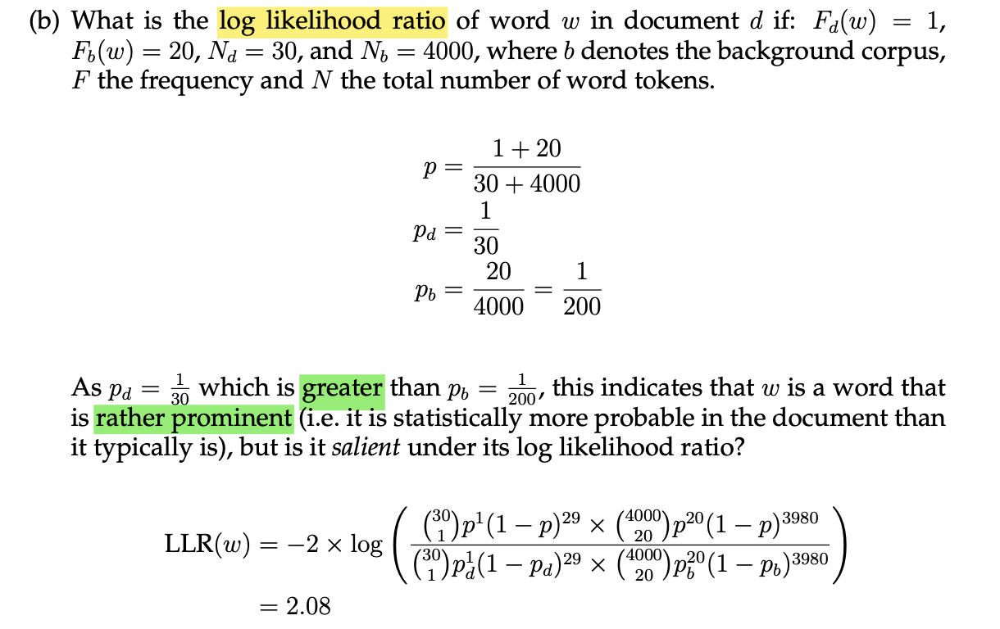