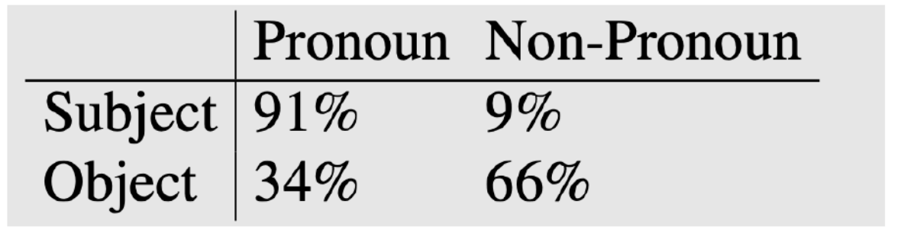
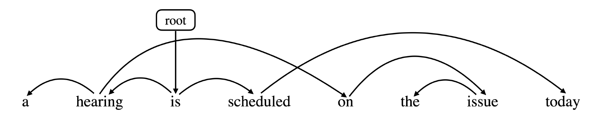
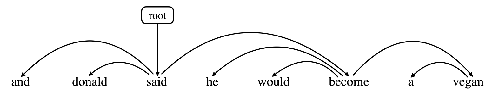

# NLP Exam 2021
##Section A: Short Answer Questions [45 marks]
Answer each of the questions in this section as briefly as possible. Expect to answer each sub-question in no more than several lines.

###Question 1: General Concepts [24 marks]
a) What is a "sequence labelling" task and how does it differ from independent prediction? Explain using "part-of-speech tagging" as an example. [6 marks]

**answer**: In POS, sequence labelling provide structured predictions that first decompose the process into individual word step, and it consider the whole sequence when learning and predicting part-of-speech tags. For independent predictions, limited context is considered when training and predicting. 

b) Compare and contrast "antecedent restrictions" and "preferences" in "anaphora resolution". You should also provide examples of these restrictions and preferences. [6 marks]

**answer**: 

- antecedent restrictions
	- pronouns must agree in number with their antecedents
		- **students** invited the teacher. **They** are happy. (they $\to$ students)
	- Pronouns must agree in gender with their antecedents
		- **Sue** was leaving for lunch when Ted arrived. **She** invited him, but he said no. (she $\to$ Sue)
	- Pronouns whose antecedents are the subject of the same syntactic clause must be reflexive
		- Ted was angry at him. [him ≠ Ted]
		- Ted was angry at himself. [himself = Ted]
- antecedent preferences
	- The antecedents of pronouns should be recent
		- the tram didn't come so he went home and got his **bike**. he planned to ride **it**. ('it' more likely refers to 'bike', not 'tram')
	- The antecedent should be salient, as determined by grammatical position. typically, subject > object > argument of preposition
		- Ted usually rode to work with Bill. He was never late. ('He' more likely to refer to the subject: 'Ted')

c) What is the "exposure bias" problem in "machine translation"? [6 marks]

**answer**: 

- Describes the discrepancy between training and testing
- Training: always have the ground truth tokens at each step
- Test: uses its own prediction at each step
- Outcome: model is unable to recover from its own error(error propagation)

d) Why do we use the "IOB tagging scheme" in "named entity recognition"? [6 marks]

**answer**: because IO tagging is not able to differentiate between: a single entity with multiple tokens and multiple entities with single tokens

###Question 2: Distributional Semantics [9 marks]
a) How can we learn "word vectors" using "count-based methods"? [6 marks]

**answer**:

- document as context:
	- consider documents as context
	- use a matirx(row as documents, columns as words) to record word counts
	- can use TF-IDF to weight raw counts to discount common words
	- then use columns as word vectors
- word as context:
	- describe how often words appear with other words in some predefined context (e.g. a window of N words)
	- use a matrix to record words' co-occurences
	- use PMI to solve common words dominance problem

b) Qualitatively, how will the word vectors differ when we use "document" vs. "word context"? [3 marks]

**answer**: if we use document context, the semantics of words we captured are more general, usually relate to some topic. However, if we use word context, the semantics of words we captured are more about local information of words around the word.

###Question 3: Context-Free Grammar [12 marks]
a) Explain two limitations of the "context-free" assumption as part of a "context-free grammar", with the aid of an example for each limitation. [6 marks]

**answer**:

- poor independence assumptions
	- Rewrite decisions made independently, whereas inter-dependence is often needed to capture global structure. Probability of a rule independent of rest of tree and no way to represent contextual differences.
	- example 
		- NP → DT NN [0.28] \(the cat), NP → PRP [0.25] \(pronoun)
		- NP → PRP should go up to 0.91 as a subject, NP → DT NN should be 0.66 as an object
- lack of lexical conditioning
	- Lack of sensitivity to words in tree
	- example: prepositional phrase attachment ambiguity
		- *Worker dumped sacks into a bin*
		- attach *into a bin* to *dump* or *sacks*?

b) What negative effect does "head lexicalisation" have on the grammar? Does "parent conditioning" have a similar issue? You should provide examples as part of your explanation. [6 marks]

**answer**: in head lexicalisation, the grammar symbol invertory will expand massively, many productions too specific (like: NP(cat), NP(workers), NP(sacks), etc), we add all these to our production rules. However, parent conditioning does not have a similar issue, it only condition on the symbol of parent non-terminal and the number of non-terminals is not so many.


### Question 4: Dependency grammar
a) What is "projectivity" in a dependency tree, and why is this property important in dependency parsing? [3 marks]

**answer**: Dependency tree is projective if all arcs are projective where an arc is projective if there is a path from head to every word that lies between the head and the dependent. firstly, when we do treebank conversion(convert CFG trees to dependency trees), the resulting dependency tree is alway projective, and hence it will be incorret when non-projective examples are encountered. Sencondly, transition-based approaches can only produce projective trees,, hence any sentences with non-projective structures will necessarily contain some errors.

b) Which arc or arcs are "non-projective" in the following tree? Explain why they are non-projective. [6 marks] 

**answer**: 

1. arc(hearing, on) is not projective, no path from 'hearing' to 'is' and 'scheduled'. 
2. arc(scheduled, today) is not projective, no path from 'scheduled' to 'on','the' and 'issue'.

c) Show a sequence of parsing steps using a "transition-based parser" that will produce the dependency tree below. Be sure to include the state of the stack and buffer at every step. [9 marks] 

**answer**:

| step | stack | buffer | action | relation added |
| ---- | ----- | ------ | ------ | -------------- |
| 0 | [root] | [and, donald, said, he, would, become, a, vegan] | shift |  |
| 1 | [root, and] | [donald, said, he, would, become, a, vegan] | shift |  |
| 2 | [root, and, donald] | [said, he, would, become, a, vegan] | shift |  |
| 3 | [root, and, donald, said] | [he, would, become, a, vegan] | leftarc | donald $\leftarrow$ said |
| 4 | [root, and, said] | [he, would, become, a, vegan] | leftarc| and $\leftarrow$ said |
| 5 | [root, said] | [he, would, become, a, vegan] | shift |  |
| 6 | [root, said, he] | [would, become, a, vegan] | shift |  |
| 7 | [root, said, he, would] | [become, a, vegan] | shift |  |
| 8 | [root, said, he, would, become] | [a, vegan] | shift |  |
| 9 | [root, said, he, would, become] | [a, vegan] | leftarc | would $\leftarrow$ become |
| 10 | [root, said, he, become] | [a, vegan] | leftarc | he $\leftarrow$ become |
| 11 | [root, said, become] | [a, vegan] | shift |  |
| 12 | [root, said, become, a] | [vegan] | shift |  |
| 13 | [root, said, become, a, vegan] | [] | leftarc | a $\leftarrow$ vegan |
| 14 | [root, said, become, vegan] | [] | rightarc | become $\rightarrow$ vegan |
| 15 | [root, said, become] | [] | rightarc | said $\rightarrow$ become |
| 16 | [root, said] | [] | rightarc | root $\rightarrow$ said |
| 17 | [root] | [] | done |  |

### Question 5: Loglikelihood Ratio
The "loglikelihood ratio" is used in summarisation to measure the "saliency" of a word compared to a
background corpus. In the second task of the project, to understand the nature of rumour vs. non-rumour
source tweets, one analysis we can do is to extract salient hashtags in rumour source tweets and non-
rumour source tweets to understand the topical differences between them. Illustrate with an example
with equations how you can apply loglikelihood ratio to extract salient hashtags in these two types of
source tweets.

**answer**: 